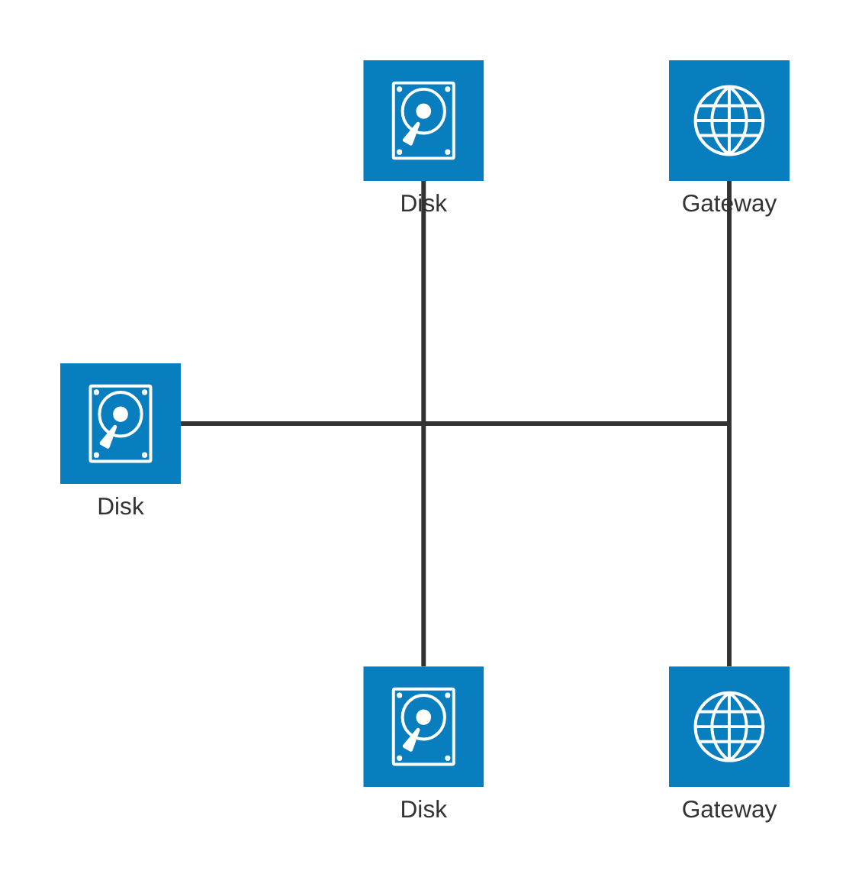
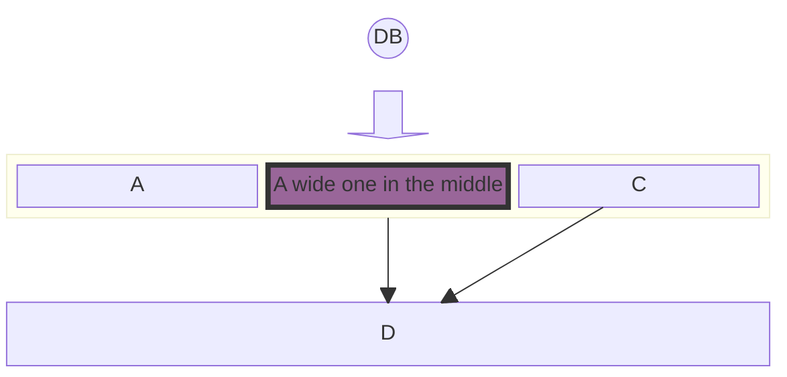
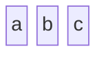
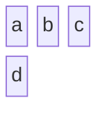
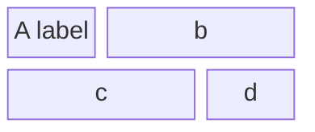
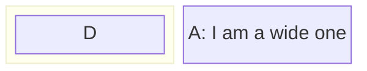
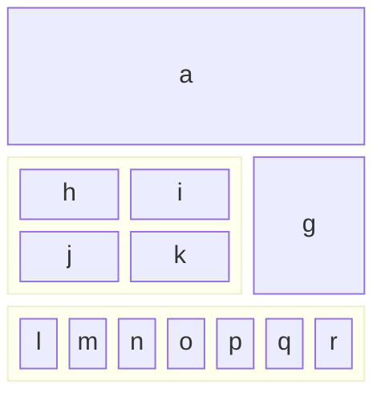
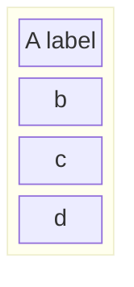

└── docs
    └── syntax
        ├── architecture.md
        ├── block.md
        ├── c4.md
        ├── classDiagram.md
        ├── entityRelationshipDiagram.md
        ├── examples.md
        ├── flowchart.md
        ├── gantt.md
        ├── gitgraph.md
        ├── img
            ├── Gantt-excluded-days-within.png
            ├── Gantt-long-weekend-look.png
            └── zenuml-participant-annotators.png
        ├── kanban.md
        ├── mindmap.md
        ├── packet.md
        ├── pie.md
        ├── quadrantChart.md
        ├── radar.md
        ├── requirementDiagram.md
        ├── sankey.md
        ├── sequenceDiagram.md
        ├── stateDiagram.md
        ├── timeline.md
        ├── userJourney.md
        ├── xyChart.md
        └── zenuml.md


/docs/syntax/architecture.md:
--------------------------------------------------------------------------------
> **Warning**
>
# Architecture Diagrams Documentation (v11.1.0+)

> In the context of mermaid-js, the architecture diagram is used to show the relationship between services and resources commonly found within the Cloud or CI/CD deployments. In an architecture diagram, services (nodes) are connected by edges. Related services can be placed within groups to better illustrate how they are organized.

## Example


## Syntax

The building blocks of an architecture are `groups`, `services`, `edges`, and `junctions`.

For supporting components, icons are declared by surrounding the icon name with `()`, while labels are declared by surrounding the text with `[]`.

To begin an architecture diagram, use the keyword `architecture-beta`, followed by your groups, services, edges, and junctions. While each of the 3 building blocks can be declared in any order, care must be taken to ensure the identifier was previously declared by another component.

### Groups

The syntax for declaring a group is:

```
group {group id}({icon name})[{title}] (in {parent id})?
```

Put together:

```
group public_api(cloud)[Public API]
```

creates a group identified as `public_api`, uses the icon `cloud`, and has the label `Public API`.

Additionally, groups can be placed within a group using the optional `in` keyword

```
group private_api(cloud)[Private API] in public_api
```

### Services

The syntax for declaring a service is:

```
service {service id}({icon name})[{title}] (in {parent id})?
```

Put together:

```
service database1(database)[My Database]
```

creates the service identified as `database1`, using the icon `database`, with the label `My Database`.

If the service belongs to a group, it can be placed inside it through the optional `in` keyword

```
service database1(database)[My Database] in private_api
```

### Edges

The syntax for declaring an edge is:

```
{serviceId}{{group}}?:{T|B|L|R} {<}?--{>}? {T|B|L|R}:{serviceId}{{group}}?
```

#### Edge Direction

The side of the service the edge comes out of is specified by adding a colon (`:`) to the side of the service connecting to the arrow and adding `L|R|T|B`

For example:

```
db:R -- L:server
```

creates an edge between the services `db` and `server`, with the edge coming out of the right of `db` and the left of `server`.

```
db:T -- L:server
```

creates a 90 degree edge between the services `db` and `server`, with the edge coming out of the top of `db` and the left of `server`.

#### Arrows

Arrows can be added to each side of an edge by adding `<` before the direction on the left, and/or `>` after the direction on the right.

For example:

```
subnet:R --> L:gateway
```

creates an edge with the arrow going into the `gateway` service

#### Edges out of Groups

To have an edge go from a group to another group or service within another group, the `{group}` modifier can be added after the `serviceId`.

For example:

```
service server[Server] in groupOne
service subnet[Subnet] in groupTwo

server{group}:B --> T:subnet{group}
```

creates an edge going out of `groupOne`, adjacent to `server`, and into `groupTwo`, adjacent to `subnet`.

It's important to note that `groupId`s cannot be used for specifying edges and the `{group}` modifier can only be used for services within a group.

### Junctions

Junctions are a special type of node which acts as a potential 4-way split between edges.

The syntax for declaring a junction is:

```
junction {junction id} (in {parent id})?
```




## Icons

By default, architecture diagram supports the following icons: `cloud`, `database`, `disk`, `internet`, `server`.
Users can use any of the 200,000+ icons available in iconify.design, or [add custom icons](../config/icons.md).

After the icons are installed, they can be used in the architecture diagram by using the format "name:icon-name", where name is the value used when registering the icon pack.

```mermaid
architecture-beta
    group api(logos:aws-lambda)[API]

    service db(logos:aws-aurora)[Database] in api
    service disk1(logos:aws-glacier)[Storage] in api
    service disk2(logos:aws-s3)[Storage] in api
    service server(logos:aws-ec2)[Server] in api

    db:L -- R:server
    disk1:T -- B:server
    disk2:T -- B:db
```




--------------------------------------------------------------------------------
/docs/syntax/block.md:
--------------------------------------------------------------------------------
> **Warning**
>
# Block Diagrams Documentation

## Introduction to Block Diagrams




### Definition and Purpose

Block diagrams are an intuitive and efficient way to represent complex systems, processes, or architectures visually. They are composed of blocks and connectors, where blocks represent the fundamental components or functions, and connectors show the relationship or flow between these components. This method of diagramming is essential in various fields such as engineering, software development, and process management.

The primary purpose of block diagrams is to provide a high-level view of a system, allowing for easy understanding and analysis without delving into the intricate details of each component. This makes them particularly useful for simplifying complex systems and for explaining the overall structure and interaction of components within a system.

Many people use mermaid flowcharts for this purpose. A side-effect of this is that the automatic layout sometimes move shapes to positions that the diagram maker does not want. Block diagrams use a different approach. In this diagram we give the author full control over where the shapes are positioned.

### General Use Cases

Block diagrams have a wide range of applications across various industries and disciplines. Some of the key use cases include:

- **Software Architecture**: In software development, block diagrams can be used to illustrate the architecture of a software application. This includes showing how different modules or services interact, data flow, and high-level component interaction.

- **Network Diagrams**: Block diagrams are ideal for representing network architectures in IT and telecommunications. They can depict how different network devices and services are interconnected, including routers, switches, firewalls, and the flow of data across the network.

- **Process Flowcharts**: In business and manufacturing, block diagrams can be employed to create process flowcharts. These flowcharts represent various stages of a business or manufacturing process, helping to visualize the sequence of steps, decision points, and the flow of control.

- **Electrical Systems**: Engineers use block diagrams to represent electrical systems and circuitry. They can illustrate the high-level structure of an electrical system, the interaction between different electrical components, and the flow of electrical currents.

- **Educational Purposes**: Block diagrams are also extensively used in educational materials to explain complex concepts and systems in a simplified manner. They help in breaking down and visualizing scientific theories, engineering principles, and technological systems.

These examples demonstrate the versatility of block diagrams in providing clear and concise representations of complex systems. Their simplicity and clarity make them a valuable tool for professionals across various fields to communicate complex ideas effectively.

In the following sections, we will delve into the specifics of creating and manipulating block diagrams using Mermaid, covering everything from basic syntax to advanced configurations and styling.

Creating block diagrams with Mermaid is straightforward and accessible. This section introduces the basic syntax and structure needed to start building simple diagrams. Understanding these foundational concepts is key to efficiently utilizing Mermaid for more complex diagramming tasks.

### Simple Block Diagrams

#### Basic Structure

At its core, a block diagram consists of blocks representing different entities or components. In Mermaid, these blocks are easily created using simple text labels. The most basic form of a block diagram can be a series of blocks without any connectors.

**Example - Simple Block Diagram**:
To create a simple block diagram with three blocks labeled 'a', 'b', and 'c', the syntax is as follows:




This example will produce a horizontal sequence of three blocks. Each block is automatically spaced and aligned for optimal readability.

### Defining the number of columns to use

#### Column Usage

While simple block diagrams are linear and straightforward, more complex systems may require a structured layout. Mermaid allows for the organization of blocks into multiple columns, facilitating the creation of more intricate and detailed diagrams.

**Example - Multi-Column Diagram:**
In scenarios where you need to distribute blocks across multiple columns, you can specify the number of columns and arrange the blocks accordingly. Here's how to create a block diagram with three columns and four blocks, where the fourth block appears in a second row:




This syntax instructs Mermaid to arrange the blocks 'a', 'b', 'c', and 'd' across three columns, wrapping to the next row as needed. This feature is particularly useful for representing layered or multi-tiered systems, such as network layers or hierarchical structures.

These basic building blocks of Mermaid's block diagrams provide a foundation for more complex diagramming. The simplicity of the syntax allows for quick creation and iteration of diagrams, making it an efficient tool for visualizing ideas and concepts. In the next section, we'll explore advanced block configuration options, including setting block widths and creating composite blocks.

## 3. Advanced Block Configuration

Building upon the basics, this section delves into more advanced features of block diagramming in Mermaid. These features allow for greater flexibility and complexity in diagram design, accommodating a wider range of use cases and scenarios.

### Setting Block Width

#### Spanning Multiple Columns

In more complex diagrams, you may need blocks that span multiple columns to emphasize certain components or to represent larger entities. Mermaid allows for the adjustment of block widths to cover multiple columns, enhancing the diagram's readability and structure.

**Example - Block Spanning Multiple Columns**:
To create a block diagram where one block spans across two columns, you can specify the desired width for each block:




In this example, the block labeled "A labels" spans one column, while blocks 'b', 'c' span 2 columns, and 'd' is again allocated its own column. This flexibility in block sizing is crucial for accurately representing systems with components of varying significance or size.

### Creating Composite Blocks

#### Nested Blocks

Composite blocks, or blocks within blocks, are an advanced feature in Mermaid's block diagram syntax. They allow for the representation of nested or hierarchical systems, where one component encompasses several subcomponents.

**Example - Composite Blocks:**
Creating a composite block involves defining a parent block and then nesting other blocks within it. Here's how to define a composite block with nested elements:




In this syntax, 'D' is a nested block within a larger parent block. This feature is particularly useful for depicting complex structures, such as a server with multiple services or a department within a larger organizational framework.

### Column Width Dynamics

#### Adjusting Widths

Mermaid also allows for dynamic adjustment of column widths based on the content of the blocks. The width of the columns is determined by the widest block in the column, ensuring that the diagram remains balanced and readable.

**Example - Dynamic Column Widths:**
In diagrams with varying block sizes, Mermaid automatically adjusts the column widths to fit the largest block in each column. Here's an example:




This example demonstrates how Mermaid dynamically adjusts the width of the columns to accommodate the widest block, in this case, 'a' and the composite block 'e'. This dynamic adjustment is essential for creating visually balanced and easy-to-understand diagrams.

**Merging Blocks Horizontally:**
In scenarios where you need to stack blocks horizontally, you can use column width to accomplish the task. Blocks can be arranged vertically by putting them in a single column. Here is how you can create a block diagram in which 4 blocks are stacked on top of each other:




In this example, the width of the merged block dynamically adjusts to the width of the largest child block.

With these advanced configuration options, Mermaid's block diagrams can be tailored to represent a wide array of complex systems and structures. The flexibility offered by these features enables users to create diagrams that are both informative and visually appealing. In the following sections, we will explore further capabilities, including different block shapes and linking options.

## 4. Block Varieties and Shapes

Mermaid's block diagrams are not limited to standard rectangular shapes. A variety of block shapes are available, allowing for a more nuanced and tailored representation of different types of information or entities. This section outlines the different block shapes you can use in Mermaid and their specific applications.

### Standard and Special Block Shapes

Mermaid supports a range of block shapes to suit different diagramming needs, from basic geometric shapes to more specialized forms.

#### Example - Round Edged Block

To create a block with round edges, which can be used to represent a softer or more flexible component:

```mermaid-example
block-beta
    id1("This is the text in the box")
```

```mermaid
block-beta
    id1("This is the text in the box")
```

#### Example - Stadium-Shaped Block

A stadium-shaped block, resembling an elongated circle, can be used for components that are process-oriented:

```mermaid-example
block-beta
    id1(["This is the text in the box"])
```

```mermaid
block-beta
    id1(["This is the text in the box"])
```

#### Example - Subroutine Shape

For representing subroutines or contained processes, a block with double vertical lines is useful:

```mermaid-example
block-beta
    id1[["This is the text in the box"]]
```

```mermaid
block-beta
    id1[["This is the text in the box"]]
```

#### Example - Cylindrical Shape

The cylindrical shape is ideal for representing databases or storage components:

```mermaid-example
block-beta
    id1[("Database")]
```

```mermaid
block-beta
    id1[("Database")]
```

#### Example - Circle Shape

A circle can be used for centralized or pivotal components:

```mermaid-example
block-beta
    id1(("This is the text in the circle"))
```

```mermaid
block-beta
    id1(("This is the text in the circle"))
```

#### Example - Asymmetric, Rhombus, and Hexagon Shapes

For decision points, use a rhombus, and for unique or specialized processes, asymmetric and hexagon shapes can be utilized:

**Asymmetric**

```mermaid-example
block-beta
  id1>"This is the text in the box"]
```

```mermaid
block-beta
  id1>"This is the text in the box"]
```

**Rhombus**

```mermaid-example
block-beta
    id1{"This is the text in the box"}
```

```mermaid
block-beta
    id1{"This is the text in the box"}
```

**Hexagon**

```mermaid-example
block-beta
    id1{{"This is the text in the box"}}
```

```mermaid
block-beta
    id1{{"This is the text in the box"}}
```

#### Example - Parallelogram and Trapezoid Shapes

Parallelogram and trapezoid shapes are perfect for inputs/outputs and transitional processes:

```mermaid-example
block-beta
  id1[/"This is the text in the box"/]
  id2[\"This is the text in the box"\]
  A[/"Christmas"\]
  B[\"Go shopping"/]
```

```mermaid
block-beta
  id1[/"This is the text in the box"/]
  id2[\"This is the text in the box"\]
  A[/"Christmas"\]
  B[\"Go shopping"/]
```

#### Example - Double Circle

For highlighting critical or high-priority components, a double circle can be effective:

```mermaid-example
block-beta
    id1((("This is the text in the circle")))
```

```mermaid
block-beta
    id1((("This is the text in the circle")))
```

### Block Arrows and Space Blocks

Mermaid also offers unique shapes like block arrows and space blocks for directional flow and spacing.

#### Example - Block Arrows

Block arrows can visually indicate direction or flow within a process:

```mermaid-example
block-beta
  blockArrowId<["Label"]>(right)
  blockArrowId2<["Label"]>(left)
  blockArrowId3<["Label"]>(up)
  blockArrowId4<["Label"]>(down)
  blockArrowId5<["Label"]>(x)
  blockArrowId6<["Label"]>(y)
  blockArrowId6<["Label"]>(x, down)
```

```mermaid
block-beta
  blockArrowId<["Label"]>(right)
  blockArrowId2<["Label"]>(left)
  blockArrowId3<["Label"]>(up)
  blockArrowId4<["Label"]>(down)
  blockArrowId5<["Label"]>(x)
  blockArrowId6<["Label"]>(y)
  blockArrowId6<["Label"]>(x, down)
```

#### Example - Space Blocks

Space blocks can be used to create intentional empty spaces in the diagram, which is useful for layout and readability:

```mermaid-example
block-beta
  columns 3
  a space b
  c   d   e
```

```mermaid
block-beta
  columns 3
  a space b
  c   d   e
```

or

```mermaid-example
block-beta
  ida space:3 idb idc
```

```mermaid
block-beta
  ida space:3 idb idc
```

Note that you can set how many columns the space block occupied using the number notation `space:num` where num is a number indicating the num columns width. You can also use `space` which defaults to one column.

The variety of shapes and special blocks in Mermaid enhances the expressive power of block diagrams, allowing for more accurate and context-specific representations. These options give users the flexibility to create diagrams that are both informative and visually appealing. In the next sections, we will explore the ways to connect these blocks and customize their appearance.

### Standard and Special Block Shapes

Discuss the various shapes available for blocks, including standard shapes and special forms like block arrows and space blocks.

## 5. Connecting Blocks with Edges

One of the key features of block diagrams in Mermaid is the ability to connect blocks using various types of edges or links. This section explores the different ways blocks can be interconnected to represent relationships and flows between components.

### Basic Linking and Arrow Types

The most fundamental aspect of connecting blocks is the use of arrows or links. These connectors depict the relationships or the flow of information between the blocks. Mermaid offers a range of arrow types to suit different diagramming needs.

**Example - Basic Links**

A simple link with an arrow can be created to show direction or flow from one block to another:

```mermaid-example
block-beta
  A space B
  A-->B
```

```mermaid
block-beta
  A space B
  A-->B
```

This example illustrates a direct connection from block 'A' to block 'B', using a straightforward arrow.

This syntax creates a line connecting 'A' and 'B', implying a relationship or connection without indicating a specific direction.

### Text on Links

In addition to connecting blocks, it's often necessary to describe or label the relationship. Mermaid allows for the inclusion of text on links, providing context to the connections.

Example - Text with Links
To add text to a link, the syntax includes the text within the link definition:

```mermaid-example
block-beta
  A space:2 B
  A-- "X" -->B
```

```mermaid
block-beta
  A space:2 B
  A-- "X" -->B
```

This example show how to add descriptive text to the links, enhancing the information conveyed by the diagram.

Example - Edges and Styles:

```mermaid-example
block-beta
columns 1
  db(("DB"))
  blockArrowId6<["&nbsp;&nbsp;&nbsp;"]>(down)
  block:ID
    A
    B["A wide one in the middle"]
    C
  end
  space
  D
  ID --> D
  C --> D
  style B fill:#939,stroke:#333,stroke-width:4px
```

```mermaid
block-beta
columns 1
  db(("DB"))
  blockArrowId6<["&nbsp;&nbsp;&nbsp;"]>(down)
  block:ID
    A
    B["A wide one in the middle"]
    C
  end
  space
  D
  ID --> D
  C --> D
  style B fill:#939,stroke:#333,stroke-width:4px
```

## 6. Styling and Customization

Beyond the structure and layout of block diagrams, Mermaid offers extensive styling options. These customization features allow for the creation of more visually distinctive and informative diagrams. This section covers how to apply individual styles to blocks and how to use classes for consistent styling across multiple elements.

### Individual Block Styling

Mermaid enables detailed styling of individual blocks, allowing you to apply various CSS properties such as color, stroke, and border thickness. This feature is especially useful for highlighting specific parts of a diagram or for adhering to certain visual themes.

#### Example - Styling a Single Block

To apply custom styles to a block, you can use the `style` keyword followed by the block identifier and the desired CSS properties:

```mermaid-example
block-beta
  id1 space id2
  id1("Start")-->id2("Stop")
  style id1 fill:#636,stroke:#333,stroke-width:4px
  style id2 fill:#bbf,stroke:#f66,stroke-width:2px,color:#fff,stroke-dasharray: 5 5
```

```mermaid
block-beta
  id1 space id2
  id1("Start")-->id2("Stop")
  style id1 fill:#636,stroke:#333,stroke-width:4px
  style id2 fill:#bbf,stroke:#f66,stroke-width:2px,color:#fff,stroke-dasharray: 5 5
```

### Class Styling

Mermaid enables applying styling to classes, which could make styling easier if you want to apply a certain set of styles to multiple elements, as you could just link those elements to a class.

#### Example - Styling a Single Class

```mermaid-example
block-beta
  A space B
  A-->B
  classDef blue fill:#6e6ce6,stroke:#333,stroke-width:4px;
  class A blue
  style B fill:#bbf,stroke:#f66,stroke-width:2px,color:#fff,stroke-dasharray: 5 5
```

```mermaid
block-beta
  A space B
  A-->B
  classDef blue fill:#6e6ce6,stroke:#333,stroke-width:4px;
  class A blue
  style B fill:#bbf,stroke:#f66,stroke-width:2px,color:#fff,stroke-dasharray: 5 5
```

In this example, a class named 'blue' is defined and applied to block 'A', while block 'B' receives individual styling. This demonstrates the flexibility of Mermaid in applying both shared and unique styles within the same diagram.

The ability to style blocks individually or through classes provides a powerful tool for enhancing the visual impact and clarity of block diagrams. Whether emphasizing certain elements or maintaining a cohesive design across the diagram, these styling capabilities are central to effective diagramming. The next sections will present practical examples and use cases, followed by tips for troubleshooting common issues.

### 7. Practical Examples and Use Cases

The versatility of Mermaid's block diagrams becomes evident when applied to real-world scenarios. This section provides practical examples demonstrating the application of various features discussed in previous sections. These examples showcase how block diagrams can be used to represent complex systems and processes in an accessible and informative manner.

### Detailed Examples Illustrating Various Features

Combining the elements of structure, linking, and styling, we can create comprehensive diagrams that serve specific purposes in different contexts.

#### Example - System Architecture

Illustrating a simple software system architecture with interconnected components:

```mermaid-example
block-beta
  columns 3
  Frontend blockArrowId6<[" "]>(right) Backend
  space:2 down<[" "]>(down)
  Disk left<[" "]>(left) Database[("Database")]

  classDef front fill:#696,stroke:#333;
  classDef back fill:#969,stroke:#333;
  class Frontend front
  class Backend,Database back
```

```mermaid
block-beta
  columns 3
  Frontend blockArrowId6<[" "]>(right) Backend
  space:2 down<[" "]>(down)
  Disk left<[" "]>(left) Database[("Database")]

  classDef front fill:#696,stroke:#333;
  classDef back fill:#969,stroke:#333;
  class Frontend front
  class Backend,Database back
```

This example shows a basic architecture with a frontend, backend, and database. The blocks are styled to differentiate between types of components.

#### Example - Business Process Flow

Representing a business process flow with decision points and multiple stages:

```mermaid-example
block-beta
  columns 3
  Start(("Start")) space:2
  down<[" "]>(down) space:2
  Decision{{"Make Decision"}} right<["Yes"]>(right) Process1["Process A"]
  downAgain<["No"]>(down) space r3<["Done"]>(down)
  Process2["Process B"] r2<["Done"]>(right) End(("End"))

  style Start fill:#969;
  style End fill:#696;
```

```mermaid
block-beta
  columns 3
  Start(("Start")) space:2
  down<[" "]>(down) space:2
  Decision{{"Make Decision"}} right<["Yes"]>(right) Process1["Process A"]
  downAgain<["No"]>(down) space r3<["Done"]>(down)
  Process2["Process B"] r2<["Done"]>(right) End(("End"))

  style Start fill:#969;
  style End fill:#696;
```

These practical examples and scenarios underscore the utility of Mermaid block diagrams in simplifying and effectively communicating complex information across various domains.

The next section, 'Troubleshooting and Common Issues', will provide insights into resolving common challenges encountered when working with Mermaid block diagrams, ensuring a smooth diagramming experience.

## 8. Troubleshooting and Common Issues

Working with Mermaid block diagrams can sometimes present challenges, especially as the complexity of the diagrams increases. This section aims to provide guidance on resolving common issues and offers tips for managing more intricate diagram structures.

### Common Syntax Errors

Understanding and avoiding common syntax errors is key to a smooth experience with Mermaid diagrams.

#### Example - Incorrect Linking

A common mistake is incorrect linking syntax, which can lead to unexpected results or broken diagrams:

```
block-beta
  A - B
```

**Correction**:
Ensure that links between blocks are correctly specified with arrows (--> or ---) to define the direction and type of connection. Also remember that one of the fundamentals for block diagram is to give the author full control of where the boxes are positioned so in the example you need to add a space between the boxes:

```mermaid-example
block-beta
  A space B
  A --> B
```

```mermaid
block-beta
  A space B
  A --> B
```

#### Example - Misplaced Styling

Applying styles in the wrong context or with incorrect syntax can lead to blocks not being styled as intended:

```mermaid-example
  block-beta
    A
    style A fill#969;
```

```mermaid
  block-beta
    A
    style A fill#969;
```

**Correction:**
Correct the syntax by ensuring proper separation of style properties with commas and using the correct CSS property format:

```mermaid-example
block-beta
  A
  style A fill:#969,stroke:#333;

```

```mermaid
block-beta
  A
  style A fill:#969,stroke:#333;

```

### Tips for Complex Diagram Structures

Managing complexity in Mermaid diagrams involves planning and employing best practices.

#### Modular Design

Break down complex diagrams into smaller, more manageable components. This approach not only makes the diagram easier to understand but also simplifies the creation and maintenance process.

#### Consistent Styling

Use classes to maintain consistent styling across similar elements. This not only saves time but also ensures a cohesive and professional appearance.

#### Comments and Documentation

Use comments with `%%` within the Mermaid syntax to document the purpose of various parts of the diagram. This practice is invaluable for maintaining clarity, especially when working in teams or returning to a diagram after some time.

With these troubleshooting tips and best practices, you can effectively manage and resolve common issues in Mermaid block diagrams. The final section, 'Conclusion', will summarize the key points covered in this documentation and invite user feedback for continuous improvement.


--------------------------------------------------------------------------------
/docs/syntax/classDiagram.md:
--------------------------------------------------------------------------------
> **Warning**
>
# Class diagrams

> "In software engineering, a class diagram in the Unified Modeling Language (UML) is a type of static structure diagram that describes the structure of a system by showing the system's classes, their attributes, operations (or methods), and the relationships among objects."
>
> -Wikipedia

The class diagram is the main building block of object-oriented modeling. It is used for general conceptual modeling of the structure of the application, and for detailed modeling to translate the models into programming code. Class diagrams can also be used for data modeling. The classes in a class diagram represent both the main elements, interactions in the application, and the classes to be programmed.

Mermaid can render class diagrams.

```mermaid-example
---
title: Animal example
---
classDiagram
    note "From Duck till Zebra"
    Animal <|-- Duck
    note for Duck "can fly\ncan swim\ncan dive\ncan help in debugging"
    Animal <|-- Fish
    Animal <|-- Zebra
    Animal : +int age
    Animal : +String gender
    Animal: +isMammal()
    Animal: +mate()
    class Duck{
        +String beakColor
        +swim()
        +quack()
    }
    class Fish{
        -int sizeInFeet
        -canEat()
    }
    class Zebra{
        +bool is_wild
        +run()
    }
```

```mermaid
---
title: Animal example
---
classDiagram
    note "From Duck till Zebra"
    Animal <|-- Duck
    note for Duck "can fly\ncan swim\ncan dive\ncan help in debugging"
    Animal <|-- Fish
    Animal <|-- Zebra
    Animal : +int age
    Animal : +String gender
    Animal: +isMammal()
    Animal: +mate()
    class Duck{
        +String beakColor
        +swim()
        +quack()
    }
    class Fish{
        -int sizeInFeet
        -canEat()
    }
    class Zebra{
        +bool is_wild
        +run()
    }
```

## Syntax

### Class

UML provides mechanisms to represent class members, such as attributes and methods, and additional information about them.
A single instance of a class in the diagram contains three compartments:

- The top compartment contains the name of the class. It is printed in bold and centered, and the first letter is capitalized. It may also contain optional annotation text describing the nature of the class.
- The middle compartment contains the attributes of the class. They are left-aligned and the first letter is lowercase.
- The bottom compartment contains the operations the class can execute. They are also left-aligned and the first letter is lowercase.

```mermaid-example
---
title: Bank example
---
classDiagram
    class BankAccount
    BankAccount : +String owner
    BankAccount : +Bigdecimal balance
    BankAccount : +deposit(amount)
    BankAccount : +withdrawal(amount)

```

```mermaid
---
title: Bank example
---
classDiagram
    class BankAccount
    BankAccount : +String owner
    BankAccount : +Bigdecimal balance
    BankAccount : +deposit(amount)
    BankAccount : +withdrawal(amount)

```

## Define a class

There are two ways to define a class:

- Explicitly using keyword **class** like `class Animal` which would define the Animal class.
- Via a **relationship** which defines two classes at a time along with their relationship. For instance, `Vehicle <|-- Car`.

```mermaid-example
classDiagram
    class Animal
    Vehicle <|-- Car
```

```mermaid
classDiagram
    class Animal
    Vehicle <|-- Car
```

Naming convention: a class name should be composed only of alphanumeric characters (including unicode), underscores, and dashes (-).

### Class labels

In case you need to provide a label for a class, you can use the following syntax:

```mermaid-example
classDiagram
    class Animal["Animal with a label"]
    class Car["Car with *! symbols"]
    Animal --> Car
```

```mermaid
classDiagram
    class Animal["Animal with a label"]
    class Car["Car with *! symbols"]
    Animal --> Car
```

You can also use backticks to escape special characters in the label:

```mermaid-example
classDiagram
    class `Animal Class!`
    class `Car Class`
    `Animal Class!` --> `Car Class`
```

```mermaid
classDiagram
    class `Animal Class!`
    class `Car Class`
    `Animal Class!` --> `Car Class`
```

## Defining Members of a class

UML provides mechanisms to represent class members such as attributes and methods, as well as additional information about them.

Mermaid distinguishes between attributes and functions/methods based on if the **parenthesis** `()` are present or not. The ones with `()` are treated as functions/methods, and all others as attributes.

There are two ways to define the members of a class, and regardless of whichever syntax is used to define the members, the output will still be same. The two different ways are :

- Associate a member of a class using **:** (colon) followed by member name, useful to define one member at a time. For example:

```mermaid-example
classDiagram
class BankAccount
BankAccount : +String owner
BankAccount : +BigDecimal balance
BankAccount : +deposit(amount)
BankAccount : +withdrawal(amount)
```

```mermaid
classDiagram
class BankAccount
BankAccount : +String owner
BankAccount : +BigDecimal balance
BankAccount : +deposit(amount)
BankAccount : +withdrawal(amount)
```

- Associate members of a class using **{}** brackets, where members are grouped within curly brackets. Suitable for defining multiple members at once. For example:

```mermaid-example
classDiagram
class BankAccount{
    +String owner
    +BigDecimal balance
    +deposit(amount)
    +withdrawal(amount)
}
```

```mermaid
classDiagram
class BankAccount{
    +String owner
    +BigDecimal balance
    +deposit(amount)
    +withdrawal(amount)
}
```

#### Return Type

Optionally you can end a method/function definition with the data type that will be returned (note: there must be a space between the final `)` and the return type). An example:

```mermaid-example
classDiagram
class BankAccount{
    +String owner
    +BigDecimal balance
    +deposit(amount) bool
    +withdrawal(amount) int
}
```

```mermaid
classDiagram
class BankAccount{
    +String owner
    +BigDecimal balance
    +deposit(amount) bool
    +withdrawal(amount) int
}
```

#### Generic Types

Generics can be represented as part of a class definition, and for class members/return types. In order to denote an item as generic, you enclose that type within `~` (**tilde**). **Nested** type declarations such as `List<List<int>>` are supported, though generics that include a comma are currently not supported. (such as `List<List<K, V>>`)

> _note_ when a generic is used within a class definition, the generic type is NOT considered part of the class name. i.e.: for any syntax which required you to reference the class name, you need to drop the type part of the definition. This also means that mermaid does not currently support having two classes with the same name, but different generic types.

```mermaid-example
classDiagram
class Square~Shape~{
    int id
    List~int~ position
    setPoints(List~int~ points)
    getPoints() List~int~
}

Square : -List~string~ messages
Square : +setMessages(List~string~ messages)
Square : +getMessages() List~string~
Square : +getDistanceMatrix() List~List~int~~
```

```mermaid
classDiagram
class Square~Shape~{
    int id
    List~int~ position
    setPoints(List~int~ points)
    getPoints() List~int~
}

Square : -List~string~ messages
Square : +setMessages(List~string~ messages)
Square : +getMessages() List~string~
Square : +getDistanceMatrix() List~List~int~~
```

#### Visibility

To describe the visibility (or encapsulation) of an attribute or method/function that is a part of a class (i.e. a class member), optional notation may be placed before that members' name:

- `+` Public
- `-` Private
- `#` Protected
- `~` Package/Internal

> _note_ you can also include additional _classifiers_ to a method definition by adding the following notation to the _end_ of the method, i.e.: after the `()` or after the return type:
>
> - `*` Abstract e.g.: `someAbstractMethod()*` or `someAbstractMethod() int*`
> - `$` Static e.g.: `someStaticMethod()$` or `someStaticMethod() String$`

> _note_ you can also include additional _classifiers_ to a field definition by adding the following notation to the very end:
>
> - `$` Static e.g.: `String someField$`

## Defining Relationship

A relationship is a general term covering the specific types of logical connections found on class and object diagrams.

```
[classA][Arrow][ClassB]
```

There are eight different types of relations defined for classes under UML which are currently supported:

| Type    | Description   |
| ------- | ------------- |
| `<\|--` | Inheritance   |
| `*--`   | Composition   |
| `o--`   | Aggregation   |
| `-->`   | Association   |
| `--`    | Link (Solid)  |
| `..>`   | Dependency    |
| `..\|>` | Realization   |
| `..`    | Link (Dashed) |

```mermaid-example
classDiagram
classA <|-- classB
classC *-- classD
classE o-- classF
classG <-- classH
classI -- classJ
classK <.. classL
classM <|.. classN
classO .. classP

```

```mermaid
classDiagram
classA <|-- classB
classC *-- classD
classE o-- classF
classG <-- classH
classI -- classJ
classK <.. classL
classM <|.. classN
classO .. classP

```

We can use the labels to describe the nature of the relation between two classes. Also, arrowheads can be used in the opposite direction as well:

```mermaid-example
classDiagram
classA --|> classB : Inheritance
classC --* classD : Composition
classE --o classF : Aggregation
classG --> classH : Association
classI -- classJ : Link(Solid)
classK ..> classL : Dependency
classM ..|> classN : Realization
classO .. classP : Link(Dashed)

```

```mermaid
classDiagram
classA --|> classB : Inheritance
classC --* classD : Composition
classE --o classF : Aggregation
classG --> classH : Association
classI -- classJ : Link(Solid)
classK ..> classL : Dependency
classM ..|> classN : Realization
classO .. classP : Link(Dashed)

```

### Labels on Relations

It is possible to add label text to a relation:

```
[classA][Arrow][ClassB]:LabelText
```

```mermaid-example
classDiagram
classA <|-- classB : implements
classC *-- classD : composition
classE o-- classF : aggregation
```

```mermaid
classDiagram
classA <|-- classB : implements
classC *-- classD : composition
classE o-- classF : aggregation
```

### Two-way relations

Relations can logically represent an N:M association:

```mermaid-example
classDiagram
    Animal <|--|> Zebra
```

```mermaid
classDiagram
    Animal <|--|> Zebra
```

Here is the syntax:

```
[Relation Type][Link][Relation Type]
```

Where `Relation Type` can be one of:

| Type  | Description |
| ----- | ----------- |
| `<\|` | Inheritance |
| `\*`  | Composition |
| `o`   | Aggregation |
| `>`   | Association |
| `<`   | Association |
| `\|>` | Realization |

And `Link` can be one of:

| Type | Description |
| ---- | ----------- |
| --   | Solid       |
| ..   | Dashed      |

### Lollipop Interfaces

Classes can also be given a special relation type that defines a lollipop interface on the class. A lollipop interface is defined using the following syntax:

- `bar ()-- foo`
- `foo --() bar`

The interface (bar) with the lollipop connects to the class (foo).

Note: Each interface that is defined is unique and is meant to not be shared between classes / have multiple edges connecting to it.

```mermaid-example
classDiagram
  bar ()-- foo
```

```mermaid
classDiagram
  bar ()-- foo
```

```mermaid-example
classDiagram
  class Class01 {
    int amount
    draw()
  }
  Class01 --() bar
  Class02 --() bar

  foo ()-- Class01
```

```mermaid
classDiagram
  class Class01 {
    int amount
    draw()
  }
  Class01 --() bar
  Class02 --() bar

  foo ()-- Class01
```

## Define Namespace

A namespace groups classes.

```mermaid-example
classDiagram
namespace BaseShapes {
    class Triangle
    class Rectangle {
      double width
      double height
    }
}
```

```mermaid
classDiagram
namespace BaseShapes {
    class Triangle
    class Rectangle {
      double width
      double height
    }
}
```

## Cardinality / Multiplicity on relations

Multiplicity or cardinality in class diagrams indicates the number of instances of one class that can be linked to an instance of the other class. For example, each company will have one or more employees (not zero), and each employee currently works for zero or one companies.

Multiplicity notations are placed near the end of an association.

The different cardinality options are :

- `1` Only 1
- `0..1` Zero or One
- `1..*` One or more
- `*` Many
- `n` n (where n>1)
- `0..n` zero to n (where n>1)
- `1..n` one to n (where n>1)

Cardinality can be easily defined by placing the text option within quotes `"` before or after a given arrow. For example:

```
[classA] "cardinality1" [Arrow] "cardinality2" [ClassB]:LabelText
```

```mermaid-example
classDiagram
    Customer "1" --> "*" Ticket
    Student "1" --> "1..*" Course
    Galaxy --> "many" Star : Contains
```

```mermaid
classDiagram
    Customer "1" --> "*" Ticket
    Student "1" --> "1..*" Course
    Galaxy --> "many" Star : Contains
```

## Annotations on classes

It is possible to annotate classes with markers to provide additional metadata about the class. This can give a clearer indication about its nature. Some common annotations include:

- `<<Interface>>` To represent an Interface class
- `<<Abstract>>` To represent an abstract class
- `<<Service>>` To represent a service class
- `<<Enumeration>>` To represent an enum

Annotations are defined within the opening `<<` and closing `>>`. There are two ways to add an annotation to a class, and either way the output will be same:

- In a **_separate line_** after a class is defined:

```mermaid-example
classDiagram
class Shape
<<interface>> Shape
Shape : noOfVertices
Shape : draw()
```

```mermaid
classDiagram
class Shape
<<interface>> Shape
Shape : noOfVertices
Shape : draw()
```

- In a **_nested structure_** along with the class definition:

```mermaid-example
classDiagram
class Shape{
    <<interface>>
    noOfVertices
    draw()
}
class Color{
    <<enumeration>>
    RED
    BLUE
    GREEN
    WHITE
    BLACK
}

```

```mermaid
classDiagram
class Shape{
    <<interface>>
    noOfVertices
    draw()
}
class Color{
    <<enumeration>>
    RED
    BLUE
    GREEN
    WHITE
    BLACK
}

```

## Comments

Comments can be entered within a class diagram, which will be ignored by the parser. Comments need to be on their own line, and must be prefaced with `%%` (double percent signs). Any text until the next newline will be treated as a comment, including any class diagram syntax.

```mermaid-example
classDiagram
%% This whole line is a comment classDiagram class Shape <<interface>>
class Shape{
    <<interface>>
    noOfVertices
    draw()
}
```

```mermaid
classDiagram
%% This whole line is a comment classDiagram class Shape <<interface>>
class Shape{
    <<interface>>
    noOfVertices
    draw()
}
```

## Setting the direction of the diagram

With class diagrams you can use the direction statement to set the direction in which the diagram will render:

```mermaid-example
classDiagram
  direction RL
  class Student {
    -idCard : IdCard
  }
  class IdCard{
    -id : int
    -name : string
  }
  class Bike{
    -id : int
    -name : string
  }
  Student "1" --o "1" IdCard : carries
  Student "1" --o "1" Bike : rides
```

```mermaid
classDiagram
  direction RL
  class Student {
    -idCard : IdCard
  }
  class IdCard{
    -id : int
    -name : string
  }
  class Bike{
    -id : int
    -name : string
  }
  Student "1" --o "1" IdCard : carries
  Student "1" --o "1" Bike : rides
```

## Interaction

It is possible to bind a click event to a node. The click can lead to either a javascript callback or to a link which will be opened in a new browser tab. **Note**: This functionality is disabled when using `securityLevel='strict'` and enabled when using `securityLevel='loose'`.

You would define these actions on a separate line after all classes have been declared.

```
action className "reference" "tooltip"
click className call callback() "tooltip"
click className href "url" "tooltip"
```

- _action_ is either `link` or `callback`, depending on which type of interaction you want to have called
- _className_ is the id of the node that the action will be associated with
- _reference_ is either the url link, or the function name for callback.
- (_optional_) tooltip is a string to be displayed when hovering over element (note: The styles of the tooltip are set by the class .mermaidTooltip.)
- note: callback function will be called with the nodeId as parameter.

## Notes

It is possible to add notes on the diagram using `note "line1\nline2"`. A note can be added for a specific class using `note for <CLASS NAME> "line1\nline2"`.

### Examples

```mermaid-example
classDiagram
    note "This is a general note"
    note for MyClass "This is a note for a class"
    class MyClass{
    }
```

```mermaid
classDiagram
    note "This is a general note"
    note for MyClass "This is a note for a class"
    class MyClass{
    }
```

_URL Link:_

```mermaid-example
classDiagram
class Shape
link Shape "https://www.github.com" "This is a tooltip for a link"
class Shape2
click Shape2 href "https://www.github.com" "This is a tooltip for a link"
```

```mermaid
classDiagram
class Shape
link Shape "https://www.github.com" "This is a tooltip for a link"
class Shape2
click Shape2 href "https://www.github.com" "This is a tooltip for a link"
```

_Callback:_

```mermaid-example
classDiagram
class Shape
callback Shape "callbackFunction" "This is a tooltip for a callback"
class Shape2
click Shape2 call callbackFunction() "This is a tooltip for a callback"
```

```mermaid
classDiagram
class Shape
callback Shape "callbackFunction" "This is a tooltip for a callback"
class Shape2
click Shape2 call callbackFunction() "This is a tooltip for a callback"
```

```html
<script>
  const callbackFunction = function () {
    alert('A callback was triggered');
  };
</script>
```

```mermaid-example
classDiagram
    class Class01
    class Class02
    callback Class01 "callbackFunction" "Callback tooltip"
    link Class02 "https://www.github.com" "This is a link"
    class Class03
    class Class04
    click Class03 call callbackFunction() "Callback tooltip"
    click Class04 href "https://www.github.com" "This is a link"
```

```mermaid
classDiagram
    class Class01
    class Class02
    callback Class01 "callbackFunction" "Callback tooltip"
    link Class02 "https://www.github.com" "This is a link"
    class Class03
    class Class04
    click Class03 call callbackFunction() "Callback tooltip"
    click Class04 href "https://www.github.com" "This is a link"
```

> **Success** The tooltip functionality and the ability to link to urls are available from version 0.5.2.

Beginner's tip—a full example using interactive links in an HTML page:

```html
<body>
  <pre class="mermaid">
    classDiagram
    Animal <|-- Duck
    Animal <|-- Fish
    Animal <|-- Zebra
    Animal : +int age
    Animal : +String gender
    Animal: +isMammal()
    Animal: +mate()
    class Duck{
      +String beakColor
      +swim()
      +quack()
      }
    class Fish{
      -int sizeInFeet
      -canEat()
      }
    class Zebra{
      +bool is_wild
      +run()
      }

      callback Duck "callback" "Tooltip"
      link Zebra "https://www.github.com" "This is a link"
  </pre>

  <script>
    const callback = function () {
      alert('A callback was triggered');
    };
    const config = {
      startOnLoad: true,
      securityLevel: 'loose',
    };
    mermaid.initialize(config);
  </script>
</body>
```

## Styling

### Styling a node

It is possible to apply specific styles such as a thicker border or a different background color to an individual node using the `style` keyword.

Note that notes and namespaces cannot be styled individually but do support themes.

```mermaid-example
classDiagram
  class Animal
  class Mineral
  style Animal fill:#f9f,stroke:#333,stroke-width:4px
  style Mineral fill:#bbf,stroke:#f66,stroke-width:2px,color:#fff,stroke-dasharray: 5 5
```

```mermaid
classDiagram
  class Animal
  class Mineral
  style Animal fill:#f9f,stroke:#333,stroke-width:4px
  style Mineral fill:#bbf,stroke:#f66,stroke-width:2px,color:#fff,stroke-dasharray: 5 5
```

#### Classes

More convenient than defining the style every time is to define a class of styles and attach this class to the nodes that
should have a different look.

A class definition looks like the example below:

```
classDef className fill:#f9f,stroke:#333,stroke-width:4px;
```

Also, it is possible to define style to multiple classes in one statement:

```
classDef firstClassName,secondClassName font-size:12pt;
```

Attachment of a class to a node is done as per below:

```
cssClass "nodeId1" className;
```

It is also possible to attach a class to a list of nodes in one statement:

```
cssClass "nodeId1,nodeId2" className;
```

A shorter form of adding a class is to attach the classname to the node using the `:::` operator:

```mermaid-example
classDiagram
    class Animal:::someclass
    classDef someclass fill:#f96
```

```mermaid
classDiagram
    class Animal:::someclass
    classDef someclass fill:#f96
```

Or:

```mermaid-example
classDiagram
    class Animal:::someclass {
        -int sizeInFeet
        -canEat()
    }
    classDef someclass fill:#f96
```

```mermaid
classDiagram
    class Animal:::someclass {
        -int sizeInFeet
        -canEat()
    }
    classDef someclass fill:#f96
```

### Default class

If a class is named default it will be applied to all nodes. Specific styles and classes should be defined afterwards to override the applied default styling.

```
classDef default fill:#f9f,stroke:#333,stroke-width:4px;
```

```mermaid-example
classDiagram
  class Animal:::pink
  class Mineral

  classDef default fill:#f96,color:red
  classDef pink color:#f9f
```

```mermaid
classDiagram
  class Animal:::pink
  class Mineral

  classDef default fill:#f96,color:red
  classDef pink color:#f9f
```

### CSS Classes

It is also possible to predefine classes in CSS styles that can be applied from the graph definition as in the example
below:

**Example style**

```html
<style>
  .styleClass > * > g {
    fill: #ff0000;
    stroke: #ffff00;
    stroke-width: 4px;
  }
</style>
```

**Example definition**

```mermaid-example
classDiagram
    class Animal:::styleClass
```

```mermaid
classDiagram
    class Animal:::styleClass
```

> cssClasses cannot be added using this shorthand method at the same time as a relation statement.

## Configuration

### Members Box

It is possible to hide the empty members box of a class node.

This is done by changing the **hideEmptyMembersBox** value of the class diagram configuration. For more information on how to edit the Mermaid configuration see the [configuration page.](https://mermaid.js.org/config/configuration.html)

```mermaid-example
---
  config:
    class:
      hideEmptyMembersBox: true
---
classDiagram
  class Duck
```

```mermaid
---
  config:
    class:
      hideEmptyMembersBox: true
---
classDiagram
  class Duck
```


--------------------------------------------------------------------------------
/docs/syntax/entityRelationshipDiagram.md:
--------------------------------------------------------------------------------
> **Warning**
>
# Entity Relationship Diagrams

> An entity–relationship model (or ER model) describes interrelated things of interest in a specific domain of knowledge. A basic ER model is composed of entity types (which classify the things of interest) and specifies relationships that can exist between entities (instances of those entity types) [Wikipedia](https://en.wikipedia.org/wiki/Entity%E2%80%93relationship_model).

Note that practitioners of ER modelling almost always refer to _entity types_ simply as _entities_. For example the `CUSTOMER` entity _type_ would be referred to simply as the `CUSTOMER` entity. This is so common it would be inadvisable to do anything else, but technically an entity is an abstract _instance_ of an entity type, and this is what an ER diagram shows - abstract instances, and the relationships between them. This is why entities are always named using singular nouns.

Mermaid can render ER diagrams

```mermaid-example
---
title: Order example
---
erDiagram
    CUSTOMER ||--o{ ORDER : places
    ORDER ||--|{ LINE-ITEM : contains
    CUSTOMER }|..|{ DELIVERY-ADDRESS : uses
```

```mermaid
---
title: Order example
---
erDiagram
    CUSTOMER ||--o{ ORDER : places
    ORDER ||--|{ LINE-ITEM : contains
    CUSTOMER }|..|{ DELIVERY-ADDRESS : uses
```

Entity names are often capitalised, although there is no accepted standard on this, and it is not required in Mermaid.

Relationships between entities are represented by lines with end markers representing cardinality. Mermaid uses the most popular crow's foot notation. The crow's foot intuitively conveys the possibility of many instances of the entity that it connects to.

ER diagrams can be used for various purposes, ranging from abstract logical models devoid of any implementation details, through to physical models of relational database tables. It can be useful to include attribute definitions on ER diagrams to aid comprehension of the purpose and meaning of entities. These do not necessarily need to be exhaustive; often a small subset of attributes is enough. Mermaid allows them to be defined in terms of their _type_ and _name_.

```mermaid-example
erDiagram
    CUSTOMER ||--o{ ORDER : places
    CUSTOMER {
        string name
        string custNumber
        string sector
    }
    ORDER ||--|{ LINE-ITEM : contains
    ORDER {
        int orderNumber
        string deliveryAddress
    }
    LINE-ITEM {
        string productCode
        int quantity
        float pricePerUnit
    }
```

```mermaid
erDiagram
    CUSTOMER ||--o{ ORDER : places
    CUSTOMER {
        string name
        string custNumber
        string sector
    }
    ORDER ||--|{ LINE-ITEM : contains
    ORDER {
        int orderNumber
        string deliveryAddress
    }
    LINE-ITEM {
        string productCode
        int quantity
        float pricePerUnit
    }
```

When including attributes on ER diagrams, you must decide whether to include foreign keys as attributes. This probably depends on how closely you are trying to represent relational table structures. If your diagram is a _logical_ model which is not meant to imply a relational implementation, then it is better to leave these out because the associative relationships already convey the way that entities are associated. For example, a JSON data structure can implement a one-to-many relationship without the need for foreign key properties, using arrays. Similarly an object-oriented programming language may use pointers or references to collections. Even for models that are intended for relational implementation, you might decide that inclusion of foreign key attributes duplicates information already portrayed by the relationships, and does not add meaning to entities. Ultimately, it's your choice.

## Syntax

### Entities and Relationships

Mermaid syntax for ER diagrams is compatible with PlantUML, with an extension to label the relationship. Each statement consists of the following parts:

```
    <first-entity> [<relationship> <second-entity> : <relationship-label>]
```

Where:

- `first-entity` is the name of an entity. Names support any unicode characters and can include spaces if surrounded by double quotes (e.g. "name with space").
- `relationship` describes the way that both entities inter-relate. See below.
- `second-entity` is the name of the other entity.
- `relationship-label` describes the relationship from the perspective of the first entity.

For example:

```
    PROPERTY ||--|{ ROOM : contains
```

This statement can be read as _a property contains one or more rooms, and a room is part of one and only one property_. You can see that the label here is from the first entity's perspective: a property contains a room, but a room does not contain a property. When considered from the perspective of the second entity, the equivalent label is usually very easy to infer. (Some ER diagrams label relationships from both perspectives, but this is not supported here, and is usually superfluous).

Only the `first-entity` part of a statement is mandatory. This makes it possible to show an entity with no relationships, which can be useful during iterative construction of diagrams. If any other parts of a statement are specified, then all parts are mandatory.

#### Unicode text

Entity names, relationships, and attributes all support unicode text.

```mermaid-example
erDiagram
    "This ❤ Unicode"
```

```mermaid
erDiagram
    "This ❤ Unicode"
```

#### Markdown formatting

Markdown formatting and text is also supported.

```mermaid-example
erDiagram
    "This **is** _Markdown_"
```

```mermaid
erDiagram
    "This **is** _Markdown_"
```

### Relationship Syntax

The `relationship` part of each statement can be broken down into three sub-components:

- the cardinality of the first entity with respect to the second
- whether the relationship confers identity on a 'child' entity
- the cardinality of the second entity with respect to the first

Cardinality is a property that describes how many elements of another entity can be related to the entity in question. In the above example a `PROPERTY` can have one or more `ROOM` instances associated to it, whereas a `ROOM` can only be associated with one `PROPERTY`. In each cardinality marker there are two characters. The outermost character represents a maximum value, and the innermost character represents a minimum value. The table below summarises possible cardinalities.

| Value (left) | Value (right) | Meaning                       |
| :----------: | :-----------: | ----------------------------- |
|    `\|o`     |     `o\|`     | Zero or one                   |
|    `\|\|`    |    `\|\|`     | Exactly one                   |
|     `}o`     |     `o{`      | Zero or more (no upper limit) |
|    `}\|`     |     `\|{`     | One or more (no upper limit)  |

**Aliases**

| Value (left) | Value (right) | Alias for    |
| :----------: | :-----------: | ------------ |
| one or zero  |  one or zero  | Zero or one  |
| zero or one  |  zero or one  | Zero or one  |
| one or more  |  one or more  | One or more  |
| one or many  |  one or many  | One or more  |
|   many(1)    |    many(1)    | One or more  |
|      1+      |      1+       | One or more  |
| zero or more | zero or more  | Zero or more |
| zero or many | zero or many  | Zero or more |
|   many(0)    |    many(0)    | Zero or more |
|      0+      |      0+       | Zero or more |
|   only one   |   only one    | Exactly one  |
|      1       |       1       | Exactly one  |

### Identification

Relationships may be classified as either _identifying_ or _non-identifying_ and these are rendered with either solid or dashed lines respectively. This is relevant when one of the entities in question cannot have independent existence without the other. For example a firm that insures people to drive cars might need to store data on `NAMED-DRIVER`s. In modelling this we might start out by observing that a `CAR` can be driven by many `PERSON` instances, and a `PERSON` can drive many `CAR`s - both entities can exist without the other, so this is a non-identifying relationship that we might specify in Mermaid as: `PERSON }|..|{ CAR : "driver"`. Note the two dots in the middle of the relationship that will result in a dashed line being drawn between the two entities. But when this many-to-many relationship is resolved into two one-to-many relationships, we observe that a `NAMED-DRIVER` cannot exist without both a `PERSON` and a `CAR` - the relationships become identifying and would be specified using hyphens, which translate to a solid line:

| Value |     Alias for     |
| :---: | :---------------: |
|  --   |   _identifying_   |
|  ..   | _non-identifying_ |

**Aliases**

|     Value     |     Alias for     |
| :-----------: | :---------------: |
|      to       |   _identifying_   |
| optionally to | _non-identifying_ |

```mermaid-example
erDiagram
    CAR ||--o{ NAMED-DRIVER : allows
    PERSON }o..o{ NAMED-DRIVER : is
```

```mermaid
erDiagram
    CAR ||--o{ NAMED-DRIVER : allows
    PERSON }o..o{ NAMED-DRIVER : is
```

```mermaid-example
erDiagram
    CAR 1 to zero or more NAMED-DRIVER : allows
    PERSON many(0) optionally to 0+ NAMED-DRIVER : is
```

```mermaid
erDiagram
    CAR 1 to zero or more NAMED-DRIVER : allows
    PERSON many(0) optionally to 0+ NAMED-DRIVER : is
```

### Attributes

Attributes can be defined for entities by specifying the entity name followed by a block containing multiple `type name` pairs, where a block is delimited by an opening `{` and a closing `}`. The attributes are rendered inside the entity boxes. For example:

```mermaid-example
erDiagram
    CAR ||--o{ NAMED-DRIVER : allows
    CAR {
        string registrationNumber
        string make
        string model
    }
    PERSON ||--o{ NAMED-DRIVER : is
    PERSON {
        string firstName
        string lastName
        int age
    }
```

```mermaid
erDiagram
    CAR ||--o{ NAMED-DRIVER : allows
    CAR {
        string registrationNumber
        string make
        string model
    }
    PERSON ||--o{ NAMED-DRIVER : is
    PERSON {
        string firstName
        string lastName
        int age
    }
```

The `type` values must begin with an alphabetic character and may contain digits, hyphens, underscores, parentheses and square brackets. The `name` values follow a similar format to `type`, but may start with an asterisk as another option to indicate an attribute is a primary key. Other than that, there are no restrictions, and there is no implicit set of valid data types.

### Entity Name Aliases

An alias can be added to an entity using square brackets. If provided, the alias will be showed in the diagram instead of the entity name. Alias names follow all of the same rules as entity names.

```mermaid-example
erDiagram
    p[Person] {
        string firstName
        string lastName
    }
    a["Customer Account"] {
        string email
    }
    p ||--o| a : has
```

```mermaid
erDiagram
    p[Person] {
        string firstName
        string lastName
    }
    a["Customer Account"] {
        string email
    }
    p ||--o| a : has
```

#### Attribute Keys and Comments

Attributes may also have a `key` or comment defined. Keys can be `PK`, `FK` or `UK`, for Primary Key, Foreign Key or Unique Key (markdown formatting and unicode is not supported for keys). To specify multiple key constraints on a single attribute, separate them with a comma (e.g., `PK, FK`). A `comment` is defined by double quotes at the end of an attribute. Comments themselves cannot have double-quote characters in them.

```mermaid-example
erDiagram
    CAR ||--o{ NAMED-DRIVER : allows
    CAR {
        string registrationNumber PK
        string make
        string model
        string[] parts
    }
    PERSON ||--o{ NAMED-DRIVER : is
    PERSON {
        string driversLicense PK "The license #"
        string(99) firstName "Only 99 characters are allowed"
        string lastName
        string phone UK
        int age
    }
    NAMED-DRIVER {
        string carRegistrationNumber PK, FK
        string driverLicence PK, FK
    }
    MANUFACTURER only one to zero or more CAR : makes
```

```mermaid
erDiagram
    CAR ||--o{ NAMED-DRIVER : allows
    CAR {
        string registrationNumber PK
        string make
        string model
        string[] parts
    }
    PERSON ||--o{ NAMED-DRIVER : is
    PERSON {
        string driversLicense PK "The license #"
        string(99) firstName "Only 99 characters are allowed"
        string lastName
        string phone UK
        int age
    }
    NAMED-DRIVER {
        string carRegistrationNumber PK, FK
        string driverLicence PK, FK
    }
    MANUFACTURER only one to zero or more CAR : makes
```

### Direction

The direction statement declares the direction of the diagram.

This declares that the diagram is oriented from top to bottom (`TB`). This can be reversed to be oriented from bottom to top (`BT`).

```mermaid-example
erDiagram
    direction TB
    CUSTOMER ||--o{ ORDER : places
    CUSTOMER {
        string name
        string custNumber
        string sector
    }
    ORDER ||--|{ LINE-ITEM : contains
    ORDER {
        int orderNumber
        string deliveryAddress
    }
    LINE-ITEM {
        string productCode
        int quantity
        float pricePerUnit
    }
```

```mermaid
erDiagram
    direction TB
    CUSTOMER ||--o{ ORDER : places
    CUSTOMER {
        string name
        string custNumber
        string sector
    }
    ORDER ||--|{ LINE-ITEM : contains
    ORDER {
        int orderNumber
        string deliveryAddress
    }
    LINE-ITEM {
        string productCode
        int quantity
        float pricePerUnit
    }
```

This declares that the diagram is oriented from left to right (`LR`). This can be reversed to be oriented from right to left (`RL`).

```mermaid-example
erDiagram
    direction LR
    CUSTOMER ||--o{ ORDER : places
    CUSTOMER {
        string name
        string custNumber
        string sector
    }
    ORDER ||--|{ LINE-ITEM : contains
    ORDER {
        int orderNumber
        string deliveryAddress
    }
    LINE-ITEM {
        string productCode
        int quantity
        float pricePerUnit
    }
```

```mermaid
erDiagram
    direction LR
    CUSTOMER ||--o{ ORDER : places
    CUSTOMER {
        string name
        string custNumber
        string sector
    }
    ORDER ||--|{ LINE-ITEM : contains
    ORDER {
        int orderNumber
        string deliveryAddress
    }
    LINE-ITEM {
        string productCode
        int quantity
        float pricePerUnit
    }
```

Possible diagram orientations are:

- TB - Top to bottom
- BT - Bottom to top
- RL - Right to left
- LR - Left to right

### Styling a node

It is possible to apply specific styles such as a thicker border or a different background color to a node.

```mermaid-example
erDiagram
    id1||--||id2 : label
    style id1 fill:#f9f,stroke:#333,stroke-width:4px
    style id2 fill:#bbf,stroke:#f66,stroke-width:2px,color:#fff,stroke-dasharray: 5 5
```

```mermaid
erDiagram
    id1||--||id2 : label
    style id1 fill:#f9f,stroke:#333,stroke-width:4px
    style id2 fill:#bbf,stroke:#f66,stroke-width:2px,color:#fff,stroke-dasharray: 5 5
```

It is also possible to attach styles to a list of nodes in one statement:

```
    style nodeId1,nodeId2 styleList
```

#### Classes

More convenient than defining the style every time is to define a class of styles and attach this class to the nodes that
should have a different look.

A class definition looks like the example below:

```
    classDef className fill:#f9f,stroke:#333,stroke-width:4px
```

It is also possible to define multiple classes in one statement:

```
    classDef firstClassName,secondClassName font-size:12pt
```

Attachment of a class to a node is done as per below:

```
    class nodeId1 className
```

It is also possible to attach a class to a list of nodes in one statement:

```
    class nodeId1,nodeId2 className
```

Multiple classes can be attached at the same time as well:

```
    class nodeId1,nodeId2 className1,className2
```

A shorter form of adding a class is to attach the classname to the node using the `:::`operator as per below:

```mermaid-example
erDiagram
    direction TB
    CAR:::someclass {
        string registrationNumber
        string make
        string model
    }
    PERSON:::someclass {
        string firstName
        string lastName
        int age
    }
    HOUSE:::someclass

    classDef someclass fill:#f96
```

```mermaid
erDiagram
    direction TB
    CAR:::someclass {
        string registrationNumber
        string make
        string model
    }
    PERSON:::someclass {
        string firstName
        string lastName
        int age
    }
    HOUSE:::someclass

    classDef someclass fill:#f96
```

This form can be used when declaring relationships between entities:

```mermaid-example
erDiagram
    CAR {
        string registrationNumber
        string make
        string model
    }
    PERSON {
        string firstName
        string lastName
        int age
    }
    PERSON:::foo ||--|| CAR : owns
    PERSON o{--|| HOUSE:::bar : has

    classDef foo stroke:#f00
    classDef bar stroke:#0f0
    classDef foobar stroke:#00f
```

```mermaid
erDiagram
    CAR {
        string registrationNumber
        string make
        string model
    }
    PERSON {
        string firstName
        string lastName
        int age
    }
    PERSON:::foo ||--|| CAR : owns
    PERSON o{--|| HOUSE:::bar : has

    classDef foo stroke:#f00
    classDef bar stroke:#0f0
    classDef foobar stroke:#00f
```

Similar to the class statement, the shorthand syntax can also apply multiple classes at once:

```
    nodeId:::className1,className2
```

### Default class

If a class is named default it will be assigned to all classes without specific class definitions.

```
    classDef default fill:#f9f,stroke:#333,stroke-width:4px;
```

> **Note:** Custom styles from style or other class statements take priority and will overwrite the default styles. (e.g. The `default` class gives nodes a background color of pink but the `blue` class will give that node a background color of blue if applied.)

```mermaid-example
erDiagram
    CAR {
        string registrationNumber
        string make
        string model
    }
    PERSON {
        string firstName
        string lastName
        int age
    }
    PERSON:::foo ||--|| CAR : owns
    PERSON o{--|| HOUSE:::bar : has

    classDef default fill:#f9f,stroke-width:4px
    classDef foo stroke:#f00
    classDef bar stroke:#0f0
    classDef foobar stroke:#00f
```

```mermaid
erDiagram
    CAR {
        string registrationNumber
        string make
        string model
    }
    PERSON {
        string firstName
        string lastName
        int age
    }
    PERSON:::foo ||--|| CAR : owns
    PERSON o{--|| HOUSE:::bar : has

    classDef default fill:#f9f,stroke-width:4px
    classDef foo stroke:#f00
    classDef bar stroke:#0f0
    classDef foobar stroke:#00f
```

## Configuration

### Layout

The layout of the diagram is handled by [`render()`](../config/setup/mermaid/interfaces/Mermaid.md#render). The default layout is dagre.

For larger or more-complex diagrams, you can alternatively apply the ELK (Eclipse Layout Kernel) layout using your YAML frontmatter's `config`. For more information, see [Customizing ELK Layout](../intro/syntax-reference.md#customizing-elk-layout).

```yaml
---
config:
  layout: elk
---
```

Your Mermaid code should be similar to the following:

```mermaid-example
---
title: Order example
config:
    layout: elk
---
erDiagram
    CUSTOMER ||--o{ ORDER : places
    ORDER ||--|{ LINE-ITEM : contains
    CUSTOMER }|..|{ DELIVERY-ADDRESS : uses
```

```mermaid
---
title: Order example
config:
    layout: elk
---
erDiagram
    CUSTOMER ||--o{ ORDER : places
    ORDER ||--|{ LINE-ITEM : contains
    CUSTOMER }|..|{ DELIVERY-ADDRESS : uses
```

> **Note**
> Note that the site needs to use mermaid version 9.4+ for this to work and have this featured enabled in the lazy-loading configuration.

<!--- cspell:locale en,en-gb --->


--------------------------------------------------------------------------------
/docs/syntax/examples.md:
--------------------------------------------------------------------------------
> **Warning**
>
# Examples

This page contains a collection of examples of diagrams and charts that can be created through mermaid and its myriad applications.

**If you wish to learn how to support mermaid on your webpage, read the [Beginner's Guide](../config/usage.md?id=usage).**

**If you wish to learn about mermaid's syntax, Read the [Diagram Syntax](../syntax/flowchart.md?id=flowcharts-basic-syntax) section.**

## Basic Pie Chart

```mermaid-example
pie title NETFLIX
         "Time spent looking for movie" : 90
         "Time spent watching it" : 10
```

```mermaid
pie title NETFLIX
         "Time spent looking for movie" : 90
         "Time spent watching it" : 10
```

```mermaid-example
pie title What Voldemort doesn't have?
         "FRIENDS" : 2
         "FAMILY" : 3
         "NOSE" : 45
```

```mermaid
pie title What Voldemort doesn't have?
         "FRIENDS" : 2
         "FAMILY" : 3
         "NOSE" : 45
```

## Basic sequence diagram

```mermaid-example
sequenceDiagram
    Alice ->> Bob: Hello Bob, how are you?
    Bob-->>John: How about you John?
    Bob--x Alice: I am good thanks!
    Bob-x John: I am good thanks!
    Note right of John: Bob thinks a long<br/>long time, so long<br/>that the text does<br/>not fit on a row.

    Bob-->Alice: Checking with John...
    Alice->John: Yes... John, how are you?
```

```mermaid
sequenceDiagram
    Alice ->> Bob: Hello Bob, how are you?
    Bob-->>John: How about you John?
    Bob--x Alice: I am good thanks!
    Bob-x John: I am good thanks!
    Note right of John: Bob thinks a long<br/>long time, so long<br/>that the text does<br/>not fit on a row.

    Bob-->Alice: Checking with John...
    Alice->John: Yes... John, how are you?
```

## Basic flowchart

```mermaid-example
graph LR
    A[Square Rect] -- Link text --> B((Circle))
    A --> C(Round Rect)
    B --> D{Rhombus}
    C --> D
```

```mermaid
graph LR
    A[Square Rect] -- Link text --> B((Circle))
    A --> C(Round Rect)
    B --> D{Rhombus}
    C --> D
```

## Larger flowchart with some styling

```mermaid-example
graph TB
    sq[Square shape] --> ci((Circle shape))

    subgraph A
        od>Odd shape]-- Two line<br/>edge comment --> ro
        di{Diamond with <br/> line break} -.-> ro(Rounded<br>square<br>shape)
        di==>ro2(Rounded square shape)
    end

    %% Notice that no text in shape are added here instead that is appended further down
    e --> od3>Really long text with linebreak<br>in an Odd shape]

    %% Comments after double percent signs
    e((Inner / circle<br>and some odd <br>special characters)) --> f(,.?!+-*ز)

    cyr[Cyrillic]-->cyr2((Circle shape Начало));

     classDef green fill:#9f6,stroke:#333,stroke-width:2px;
     classDef orange fill:#f96,stroke:#333,stroke-width:4px;
     class sq,e green
     class di orange
```

```mermaid
graph TB
    sq[Square shape] --> ci((Circle shape))

    subgraph A
        od>Odd shape]-- Two line<br/>edge comment --> ro
        di{Diamond with <br/> line break} -.-> ro(Rounded<br>square<br>shape)
        di==>ro2(Rounded square shape)
    end

    %% Notice that no text in shape are added here instead that is appended further down
    e --> od3>Really long text with linebreak<br>in an Odd shape]

    %% Comments after double percent signs
    e((Inner / circle<br>and some odd <br>special characters)) --> f(,.?!+-*ز)

    cyr[Cyrillic]-->cyr2((Circle shape Начало));

     classDef green fill:#9f6,stroke:#333,stroke-width:2px;
     classDef orange fill:#f96,stroke:#333,stroke-width:4px;
     class sq,e green
     class di orange
```

## SequenceDiagram: Loops, alt and opt

```mermaid-example
sequenceDiagram
    loop Daily query
        Alice->>Bob: Hello Bob, how are you?
        alt is sick
            Bob->>Alice: Not so good :(
        else is well
            Bob->>Alice: Feeling fresh like a daisy
        end

        opt Extra response
            Bob->>Alice: Thanks for asking
        end
    end
```

```mermaid
sequenceDiagram
    loop Daily query
        Alice->>Bob: Hello Bob, how are you?
        alt is sick
            Bob->>Alice: Not so good :(
        else is well
            Bob->>Alice: Feeling fresh like a daisy
        end

        opt Extra response
            Bob->>Alice: Thanks for asking
        end
    end
```

## SequenceDiagram: Message to self in loop

```mermaid-example
sequenceDiagram
    participant Alice
    participant Bob
    Alice->>John: Hello John, how are you?
    loop HealthCheck
        John->>John: Fight against hypochondria
    end
    Note right of John: Rational thoughts<br/>prevail...
    John-->>Alice: Great!
    John->>Bob: How about you?
    Bob-->>John: Jolly good!
```

```mermaid
sequenceDiagram
    participant Alice
    participant Bob
    Alice->>John: Hello John, how are you?
    loop HealthCheck
        John->>John: Fight against hypochondria
    end
    Note right of John: Rational thoughts<br/>prevail...
    John-->>Alice: Great!
    John->>Bob: How about you?
    Bob-->>John: Jolly good!
```

## Sequence Diagram: Blogging app service communication

```mermaid-example
sequenceDiagram
    participant web as Web Browser
    participant blog as Blog Service
    participant account as Account Service
    participant mail as Mail Service
    participant db as Storage

    Note over web,db: The user must be logged in to submit blog posts
    web->>+account: Logs in using credentials
    account->>db: Query stored accounts
    db->>account: Respond with query result

    alt Credentials not found
        account->>web: Invalid credentials
    else Credentials found
        account->>-web: Successfully logged in

        Note over web,db: When the user is authenticated, they can now submit new posts
        web->>+blog: Submit new post
        blog->>db: Store post data

        par Notifications
            blog--)mail: Send mail to blog subscribers
            blog--)db: Store in-site notifications
        and Response
            blog-->>-web: Successfully posted
        end
    end

```

```mermaid
sequenceDiagram
    participant web as Web Browser
    participant blog as Blog Service
    participant account as Account Service
    participant mail as Mail Service
    participant db as Storage

    Note over web,db: The user must be logged in to submit blog posts
    web->>+account: Logs in using credentials
    account->>db: Query stored accounts
    db->>account: Respond with query result

    alt Credentials not found
        account->>web: Invalid credentials
    else Credentials found
        account->>-web: Successfully logged in

        Note over web,db: When the user is authenticated, they can now submit new posts
        web->>+blog: Submit new post
        blog->>db: Store post data

        par Notifications
            blog--)mail: Send mail to blog subscribers
            blog--)db: Store in-site notifications
        and Response
            blog-->>-web: Successfully posted
        end
    end

```

## A commit flow diagram.

```mermaid-example
gitGraph:
    commit "Ashish"
    branch newbranch
    checkout newbranch
    commit id:"1111"
    commit tag:"test"
    checkout main
    commit type: HIGHLIGHT
    commit
    merge newbranch
    commit
    branch b2
    commit
```

```mermaid
gitGraph:
    commit "Ashish"
    branch newbranch
    checkout newbranch
    commit id:"1111"
    commit tag:"test"
    checkout main
    commit type: HIGHLIGHT
    commit
    merge newbranch
    commit
    branch b2
    commit
```

<!--- cspell:ignore Ashish newbranch --->


--------------------------------------------------------------------------------
/docs/syntax/img/Gantt-excluded-days-within.png:
--------------------------------------------------------------------------------
https://raw.githubusercontent.com/mermaid-js/mermaid/develop/docs/syntax/img/Gantt-excluded-days-within.png


--------------------------------------------------------------------------------
/docs/syntax/img/Gantt-long-weekend-look.png:
--------------------------------------------------------------------------------
https://raw.githubusercontent.com/mermaid-js/mermaid/develop/docs/syntax/img/Gantt-long-weekend-look.png


--------------------------------------------------------------------------------
/docs/syntax/img/zenuml-participant-annotators.png:
--------------------------------------------------------------------------------
https://raw.githubusercontent.com/mermaid-js/mermaid/develop/docs/syntax/img/zenuml-participant-annotators.png


--------------------------------------------------------------------------------
/docs/syntax/kanban.md:
--------------------------------------------------------------------------------
> **Warning**
>
# Mermaid Kanban Diagram Documentation

Mermaid’s Kanban diagram allows you to create visual representations of tasks moving through different stages of a workflow. This guide explains how to use the Kanban diagram syntax, based on the provided example.

## Overview

A Kanban diagram in Mermaid starts with the kanban keyword, followed by the definition of columns (stages) and tasks within those columns.

```mermaid-example
kanban
  column1[Column Title]
    task1[Task Description]
```

```mermaid
kanban
  column1[Column Title]
    task1[Task Description]
```

## Defining Columns

Columns represent the different stages in your workflow, such as “Todo,” “In Progress,” “Done,” etc. Each column is defined using a unique identifier and a title enclosed in square brackets.

**Syntax:**

```
columnId[Column Title]
```

- columnId: A unique identifier for the column.
- \[Column Title]: The title displayed on the column header.

Like this `id1[Todo]`

## Adding Tasks to Columns

Tasks are listed under their respective columns with an indentation. Each task also has a unique identifier and a description enclosed in square brackets.

**Syntax:**

```
taskId[Task Description]
```

```
•	taskId: A unique identifier for the task.
•	[Task Description]: The description of the task.
```

**Example:**

```
docs[Create Documentation]
```

## Adding Metadata to Tasks

You can include additional metadata for each task using the @{ ... } syntax. Metadata can contain key-value pairs like assigned, ticket, priority, etc. This will be rendered added to the rendering of the node.

## Supported Metadata Keys

```
•	assigned: Specifies who is responsible for the task.
•	ticket: Links the task to a ticket or issue number.
•	priority: Indicates the urgency of the task. Allowed values: 'Very High', 'High', 'Low' and 'Very Low'
```

```mermaid-example
kanban
todo[Todo]
  id3[Update Database Function]@{ ticket: MC-2037, assigned: 'knsv', priority: 'High' }
```

```mermaid
kanban
todo[Todo]
  id3[Update Database Function]@{ ticket: MC-2037, assigned: 'knsv', priority: 'High' }
```

## Configuration Options

You can customize the Kanban diagram using a configuration block at the beginning of your markdown file. This is useful for setting global settings like a base URL for tickets. Currently there is one configuration option for kanban diagrams `ticketBaseUrl`. This can be set as in the following example:

```yaml
---
config:
  kanban:
    ticketBaseUrl: 'https://yourproject.atlassian.net/browse/#TICKET#'
---
```

When the kanban item has an assigned ticket number the ticket number in the diagram will have a link to an external system where the ticket is defined. The `ticketBaseUrl` sets the base URL to the external system and #TICKET# is replaced with the ticket value from task metadata to create a valid link.

## Full Example

Below is the full Kanban diagram based on the provided example:

```mermaid-example
---
config:
  kanban:
    ticketBaseUrl: 'https://mermaidchart.atlassian.net/browse/#TICKET#'
---
kanban
  Todo
    [Create Documentation]
    docs[Create Blog about the new diagram]
  [In progress]
    id6[Create renderer so that it works in all cases. We also add some extra text here for testing purposes. And some more just for the extra flare.]
  id9[Ready for deploy]
    id8[Design grammar]@{ assigned: 'knsv' }
  id10[Ready for test]
    id4[Create parsing tests]@{ ticket: MC-2038, assigned: 'K.Sveidqvist', priority: 'High' }
    id66[last item]@{ priority: 'Very Low', assigned: 'knsv' }
  id11[Done]
    id5[define getData]
    id2[Title of diagram is more than 100 chars when user duplicates diagram with 100 char]@{ ticket: MC-2036, priority: 'Very High'}
    id3[Update DB function]@{ ticket: MC-2037, assigned: knsv, priority: 'High' }

  id12[Can't reproduce]
    id3[Weird flickering in Firefox]
```

```mermaid
---
config:
  kanban:
    ticketBaseUrl: 'https://mermaidchart.atlassian.net/browse/#TICKET#'
---
kanban
  Todo
    [Create Documentation]
    docs[Create Blog about the new diagram]
  [In progress]
    id6[Create renderer so that it works in all cases. We also add some extra text here for testing purposes. And some more just for the extra flare.]
  id9[Ready for deploy]
    id8[Design grammar]@{ assigned: 'knsv' }
  id10[Ready for test]
    id4[Create parsing tests]@{ ticket: MC-2038, assigned: 'K.Sveidqvist', priority: 'High' }
    id66[last item]@{ priority: 'Very Low', assigned: 'knsv' }
  id11[Done]
    id5[define getData]
    id2[Title of diagram is more than 100 chars when user duplicates diagram with 100 char]@{ ticket: MC-2036, priority: 'Very High'}
    id3[Update DB function]@{ ticket: MC-2037, assigned: knsv, priority: 'High' }

  id12[Can't reproduce]
    id3[Weird flickering in Firefox]
```

In conclusion, creating a Kanban diagram in Mermaid is a straightforward process that effectively visualizes your workflow. Start by using the kanban keyword to initiate the diagram. Define your columns with unique identifiers and titles to represent different stages of your project. Under each column, list your tasks—also with unique identifiers—and provide detailed descriptions as needed. Remember that proper indentation is crucial; tasks must be indented under their parent columns to maintain the correct structure.

You can enhance your diagram by adding optional metadata to tasks using the @{ ... } syntax, which allows you to include additional context such as assignee, ticket numbers, and priority levels. For further customization, utilize the configuration block at the top of your file to set global options like ticketBaseUrl for linking tickets directly from your diagram.

By adhering to these guidelines—ensuring unique identifiers, proper indentation, and utilizing metadata and configuration options—you can create a comprehensive and customized Kanban board that effectively maps out your project’s workflow using Mermaid.


--------------------------------------------------------------------------------
/docs/syntax/mindmap.md:
--------------------------------------------------------------------------------
> **Warning**
>
# Mindmap

> Mindmap: This is an experimental diagram for now. The syntax and properties can change in future releases. The syntax is stable except for the icon integration which is the experimental part.

"A mind map is a diagram used to visually organize information into a hierarchy, showing relationships among pieces of the whole. It is often created around a single concept, drawn as an image in the center of a blank page, to which associated representations of ideas such as images, words and parts of words are added. Major ideas are connected directly to the central concept, and other ideas branch out from those major ideas." Wikipedia

### An example of a mindmap.

```mermaid-example
mindmap
  root((mindmap))
    Origins
      Long history
      ::icon(fa fa-book)
      Popularisation
        British popular psychology author Tony Buzan
    Research
      On effectiveness<br/>and features
      On Automatic creation
        Uses
            Creative techniques
            Strategic planning
            Argument mapping
    Tools
      Pen and paper
      Mermaid

```

```mermaid
mindmap
  root((mindmap))
    Origins
      Long history
      ::icon(fa fa-book)
      Popularisation
        British popular psychology author Tony Buzan
    Research
      On effectiveness<br/>and features
      On Automatic creation
        Uses
            Creative techniques
            Strategic planning
            Argument mapping
    Tools
      Pen and paper
      Mermaid

```

## Syntax

The syntax for creating Mindmaps is simple and relies on indentation for setting the levels in the hierarchy.

In the following example you can see how there are 3 different levels. One with starting at the left of the text and another level with two rows starting at the same column, defining the node A. At the end there is one more level where the text is indented further than the previous lines defining the nodes B and C.

```
mindmap
    Root
        A
            B
            C
```

In summary is a simple text outline where there is one node at the root level called `Root` which has one child `A`. `A` in turn has two children `B`and `C`. In the diagram below we can see this rendered as a mindmap.

```mermaid-example
mindmap
Root
    A
      B
      C
```

```mermaid
mindmap
Root
    A
      B
      C
```

In this way we can use a text outline to generate a hierarchical mindmap.

## Different shapes

Mermaid mindmaps can show nodes using different shapes. When specifying a shape for a node the syntax is similar to flowchart nodes, with an id followed by the shape definition and with the text within the shape delimiters. Where possible we try/will try to keep the same shapes as for flowcharts, even though they are not all supported from the start.

Mindmap can show the following shapes:

### Square

```mermaid-example
mindmap
    id[I am a square]
```

```mermaid
mindmap
    id[I am a square]
```

### Rounded square

```mermaid-example
mindmap
    id(I am a rounded square)
```

```mermaid
mindmap
    id(I am a rounded square)
```

### Circle

```mermaid-example
mindmap
    id((I am a circle))
```

```mermaid
mindmap
    id((I am a circle))
```

### Bang

```mermaid-example
mindmap
    id))I am a bang((
```

```mermaid
mindmap
    id))I am a bang((
```

### Cloud

```mermaid-example
mindmap
    id)I am a cloud(
```

```mermaid
mindmap
    id)I am a cloud(
```

### Hexagon

```mermaid-example
mindmap
    id{{I am a hexagon}}
```

```mermaid
mindmap
    id{{I am a hexagon}}
```

### Default

```mermaid-example
mindmap
    I am the default shape
```

```mermaid
mindmap
    I am the default shape
```

More shapes will be added, beginning with the shapes available in flowcharts.

# Icons and classes

## Icons

As with flowcharts you can add icons to your nodes but with an updated syntax. The styling for the font based icons are added during the integration so that they are available for the web page. _This is not something a diagram author can do but has to be done with the site administrator or the integrator_. Once the icon fonts are in place you add them to the mind map nodes using the `::icon()` syntax. You place the classes for the icon within the parenthesis like in the following example where icons for material design and [Font Awesome 5](https://fontawesome.com/v5/search?o=r&m=free) are displayed. The intention is that this approach should be used for all diagrams supporting icons. **Experimental feature:** This wider scope is also the reason Mindmaps are experimental as this syntax and approach could change.

```mermaid-example
mindmap
    Root
        A
        ::icon(fa fa-book)
        B(B)
        ::icon(mdi mdi-skull-outline)
```

```mermaid
mindmap
    Root
        A
        ::icon(fa fa-book)
        B(B)
        ::icon(mdi mdi-skull-outline)
```

## Classes

Again the syntax for adding classes is similar to flowcharts. You can add classes using a triple colon following a number of css classes separated by space. In the following example one of the nodes has two custom classes attached urgent turning the background red and the text white and large increasing the font size:

```mermaid-example
mindmap
    Root
        A[A]
        :::urgent large
        B(B)
        C
```

```mermaid
mindmap
    Root
        A[A]
        :::urgent large
        B(B)
        C
```

_These classes need to be supplied by the site administrator._

## Unclear indentation

The actual indentation does not really matter only compared with the previous rows. If we take the previous example and disrupt it a little we can see how the calculations are performed. Let us start with placing C with a smaller indentation than `B` but larger then `A`.

```
mindmap
    Root
        A
            B
          C
```

This outline is unclear as `B` clearly is a child of `A` but when we move on to `C` the clarity is lost. `C` is neither a child of `B` with a higher indentation nor does it have the same indentation as `B`. The only thing that is clear is that the first node with smaller indentation, indicating a parent, is A. Then Mermaid relies on this known truth and compensates for the unclear indentation and selects `A` as a parent of `C` leading till the same diagram with `B` and `C` as siblings.

```mermaid-example
mindmap
Root
    A
        B
      C
```

```mermaid
mindmap
Root
    A
        B
      C
```

## Markdown Strings

The "Markdown Strings" feature enhances mind maps by offering a more versatile string type, which supports text formatting options such as bold and italics, and automatically wraps text within labels.

```mermaid-example
mindmap
    id1["`**Root** with
a second line
Unicode works too: 🤓`"]
      id2["`The dog in **the** hog... a *very long text* that wraps to a new line`"]
      id3[Regular labels still works]
```

```mermaid
mindmap
    id1["`**Root** with
a second line
Unicode works too: 🤓`"]
      id2["`The dog in **the** hog... a *very long text* that wraps to a new line`"]
      id3[Regular labels still works]
```

Formatting:

- For bold text, use double asterisks \*\* before and after the text.
- For italics, use single asterisks \* before and after the text.
- With traditional strings, you needed to add <br> tags for text to wrap in nodes. However, markdown strings automatically wrap text when it becomes too long and allows you to start a new line by simply using a newline character instead of a <br> tag.

## Integrating with your library/website.

Mindmap uses the experimental lazy loading & async rendering features which could change in the future. From version 9.4.0 this diagram is included in mermaid but use lazy loading in order to keep the size of mermaid down. This is important in order to be able to add additional diagrams going forward.

You can still use the pre 9.4.0 method to add mermaid with mindmaps to a web page:

```html
<script type="module">
  import mermaid from 'https://cdn.jsdelivr.net/npm/mermaid@9.3.0/dist/mermaid.esm.min.mjs';
  import mindmap from 'https://cdn.jsdelivr.net/npm/@mermaid-js/mermaid-mindmap@9.3.0/dist/mermaid-mindmap.esm.min.mjs';
  await mermaid.registerExternalDiagrams([mindmap]);
</script>
```

From version 9.4.0 you can simplify this code to:

```html
<script type="module">
  import mermaid from 'https://cdn.jsdelivr.net/npm/mermaid@11/dist/mermaid.esm.min.mjs';
</script>
```

You can also refer the [implementation in the live editor](https://github.com/mermaid-js/mermaid-live-editor/blob/develop/src/lib/util/mermaid.ts) to see how the async loading is done.

<!---
cspell:locale en,en-gb
cspell:ignore Buzan
--->


--------------------------------------------------------------------------------
/docs/syntax/packet.md:
--------------------------------------------------------------------------------
> **Warning**
>
# Packet Diagram (v11.0.0+)

## Introduction

A packet diagram is a visual representation used to illustrate the structure and contents of a network packet. Network packets are the fundamental units of data transferred over a network.

## Usage

This diagram type is particularly useful for developers, network engineers, educators, and students who require a clear and concise way to represent the structure of network packets.

## Syntax

```md
packet-beta
start: "Block name" %% Single-bit block
start-end: "Block name" %% Multi-bit blocks
... More Fields ...
```

## Examples

```mermaid-example
---
title: "TCP Packet"
---
packet-beta
0-15: "Source Port"
16-31: "Destination Port"
32-63: "Sequence Number"
64-95: "Acknowledgment Number"
96-99: "Data Offset"
100-105: "Reserved"
106: "URG"
107: "ACK"
108: "PSH"
109: "RST"
110: "SYN"
111: "FIN"
112-127: "Window"
128-143: "Checksum"
144-159: "Urgent Pointer"
160-191: "(Options and Padding)"
192-255: "Data (variable length)"
```

```mermaid
---
title: "TCP Packet"
---
packet-beta
0-15: "Source Port"
16-31: "Destination Port"
32-63: "Sequence Number"
64-95: "Acknowledgment Number"
96-99: "Data Offset"
100-105: "Reserved"
106: "URG"
107: "ACK"
108: "PSH"
109: "RST"
110: "SYN"
111: "FIN"
112-127: "Window"
128-143: "Checksum"
144-159: "Urgent Pointer"
160-191: "(Options and Padding)"
192-255: "Data (variable length)"
```

```mermaid-example
packet-beta
title UDP Packet
0-15: "Source Port"
16-31: "Destination Port"
32-47: "Length"
48-63: "Checksum"
64-95: "Data (variable length)"
```

```mermaid
packet-beta
title UDP Packet
0-15: "Source Port"
16-31: "Destination Port"
32-47: "Length"
48-63: "Checksum"
64-95: "Data (variable length)"
```

## Details of Syntax

- **Ranges**: Each line after the title represents a different field in the packet. The range (e.g., `0-15`) indicates the bit positions in the packet.
- **Field Description**: A brief description of what the field represents, enclosed in quotes.

## Configuration

Please refer to the [configuration](/config/schema-docs/config-defs-packet-diagram-config.html) guide for details.

<!--

Theme variables are not currently working due to a mermaid bug. The passed values are not being propagated into styles function.

## Theme Variables

| Property         | Description                | Default Value |
| ---------------- | -------------------------- | ------------- |
| byteFontSize     | Font size of the bytes     | '10px'        |
| startByteColor   | Color of the starting byte | 'black'       |
| endByteColor     | Color of the ending byte   | 'black'       |
| labelColor       | Color of the labels        | 'black'       |
| labelFontSize    | Font size of the labels    | '12px'        |
| titleColor       | Color of the title         | 'black'       |
| titleFontSize    | Font size of the title     | '14px'        |
| blockStrokeColor | Color of the block stroke  | 'black'       |
| blockStrokeWidth | Width of the block stroke  | '1'           |
| blockFillColor   | Fill color of the block    | '#efefef'     |

## Example on config and theme

```mermaid-example
---
config:
  packet:
    showBits: true
  themeVariables:
    packet:
      startByteColor: red
---
packet-beta
0-15: "Source Port"
16-31: "Destination Port"
32-63: "Sequence Number"
```

-->


--------------------------------------------------------------------------------
/docs/syntax/pie.md:
--------------------------------------------------------------------------------
> **Warning**
>
# Pie chart diagrams

> A pie chart (or a circle chart) is a circular statistical graphic, which is divided into slices to illustrate numerical proportion. In a pie chart, the arc length of each slice (and consequently its central angle and area), is proportional to the quantity it represents. While it is named for its resemblance to a pie which has been sliced, there are variations on the way it can be presented. The earliest known pie chart is generally credited to William Playfair's Statistical Breviary of 1801
> -Wikipedia

Mermaid can render Pie Chart diagrams.

```mermaid-example
pie title Pets adopted by volunteers
    "Dogs" : 386
    "Cats" : 85
    "Rats" : 15
```

```mermaid
pie title Pets adopted by volunteers
    "Dogs" : 386
    "Cats" : 85
    "Rats" : 15
```

## Syntax

Drawing a pie chart is really simple in mermaid.

- Start with `pie` keyword to begin the diagram
  - `showData` to render the actual data values after the legend text. This is **_OPTIONAL_**
- Followed by `title` keyword and its value in string to give a title to the pie-chart. This is **_OPTIONAL_**
- Followed by dataSet. Pie slices will be ordered clockwise in the same order as the labels.
  - `label` for a section in the pie diagram within `" "` quotes.
  - Followed by `:` colon as separator
  - Followed by `positive numeric value` (supported up to two decimal places)

\[pie] \[showData] (OPTIONAL)
\[title] \[titlevalue] (OPTIONAL)
"\[datakey1]" : \[dataValue1]
"\[datakey2]" : \[dataValue2]
"\[datakey3]" : \[dataValue3]
.
.

## Example

```mermaid-example
---
config:
  pie:
    textPosition: 0.5
  themeVariables:
    pieOuterStrokeWidth: "5px"
---
pie showData
    title Key elements in Product X
    "Calcium" : 42.96
    "Potassium" : 50.05
    "Magnesium" : 10.01
    "Iron" :  5
```

```mermaid
---
config:
  pie:
    textPosition: 0.5
  themeVariables:
    pieOuterStrokeWidth: "5px"
---
pie showData
    title Key elements in Product X
    "Calcium" : 42.96
    "Potassium" : 50.05
    "Magnesium" : 10.01
    "Iron" :  5
```

## Configuration

Possible pie diagram configuration parameters:

| Parameter      | Description                                                                                                  | Default value |
| -------------- | ------------------------------------------------------------------------------------------------------------ | ------------- |
| `textPosition` | The axial position of the pie slice labels, from 0.0 at the center to 1.0 at the outside edge of the circle. | `0.75`        |


--------------------------------------------------------------------------------
/docs/syntax/quadrantChart.md:
--------------------------------------------------------------------------------
> **Warning**
>
# Quadrant Chart

> A quadrant chart is a visual representation of data that is divided into four quadrants. It is used to plot data points on a two-dimensional grid, with one variable represented on the x-axis and another variable represented on the y-axis. The quadrants are determined by dividing the chart into four equal parts based on a set of criteria that is specific to the data being analyzed. Quadrant charts are often used to identify patterns and trends in data, and to prioritize actions based on the position of data points within the chart. They are commonly used in business, marketing, and risk management, among other fields.

## Example

```mermaid-example
quadrantChart
    title Reach and engagement of campaigns
    x-axis Low Reach --> High Reach
    y-axis Low Engagement --> High Engagement
    quadrant-1 We should expand
    quadrant-2 Need to promote
    quadrant-3 Re-evaluate
    quadrant-4 May be improved
    Campaign A: [0.3, 0.6]
    Campaign B: [0.45, 0.23]
    Campaign C: [0.57, 0.69]
    Campaign D: [0.78, 0.34]
    Campaign E: [0.40, 0.34]
    Campaign F: [0.35, 0.78]
```

```mermaid
quadrantChart
    title Reach and engagement of campaigns
    x-axis Low Reach --> High Reach
    y-axis Low Engagement --> High Engagement
    quadrant-1 We should expand
    quadrant-2 Need to promote
    quadrant-3 Re-evaluate
    quadrant-4 May be improved
    Campaign A: [0.3, 0.6]
    Campaign B: [0.45, 0.23]
    Campaign C: [0.57, 0.69]
    Campaign D: [0.78, 0.34]
    Campaign E: [0.40, 0.34]
    Campaign F: [0.35, 0.78]
```

## Syntax

> **Note**
> If there are no points available in the chart both **axis** text and **quadrant** will be rendered in the center of the respective quadrant.
> If there are points **x-axis** labels will rendered from the left of the respective quadrant also they will be displayed at the bottom of the chart, and **y-axis** labels will be rendered at the bottom of the respective quadrant, the quadrant text will render at the top of the respective quadrant.

> **Note**
> For points x and y value min value is 0 and max value is 1.

### Title

The title is a short description of the chart and it will always render on top of the chart.

#### Example

```
quadrantChart
    title This is a sample example
```

### x-axis

The x-axis determines what text would be displayed in the x-axis. In x-axis there is two part **left** and **right** you can pass **both** or you can pass only **left**. The statement should start with `x-axis` then the `left axis text` followed by the delimiter `-->` then `right axis text`.

#### Example

1. `x-axis <text> --> <text>` both the left and right axis text will be rendered.
2. `x-axis <text>` only the left axis text will be rendered.

### y-axis

The y-axis determines what text would be displayed in the y-axis. In y-axis there is two part **top** and **bottom** you can pass **both** or you can pass only **bottom**. The statement should start with `y-axis` then the `bottom axis text` followed by the delimiter `-->` then `top axis text`.

#### Example

1. `y-axis <text> --> <text>` both the bottom and top axis text will be rendered.
2. `y-axis <text>` only the bottom axis text will be rendered.

### Quadrants text

The `quadrant-[1,2,3,4]` determine what text would be displayed inside the quadrants.

#### Example

1. `quadrant-1 <text>` determine what text will be rendered inside the top right quadrant.
2. `quadrant-2 <text>` determine what text will be rendered inside the top left quadrant.
3. `quadrant-3 <text>` determine what text will be rendered inside the bottom left quadrant.
4. `quadrant-4 <text>` determine what text will be rendered inside the bottom right quadrant.

### Points

Points are used to plot a circle inside the quadrantChart. The syntax is `<text>: [x, y]` here x and y value is in the range 0 - 1.

#### Example

1. `Point 1: [0.75, 0.80]` here the Point 1 will be drawn in the top right quadrant.
2. `Point 2: [0.35, 0.24]` here the Point 2 will be drawn in the bottom left quadrant.

## Chart Configurations

| Parameter                         | Description                                                                                        | Default value |
| --------------------------------- | -------------------------------------------------------------------------------------------------- | :-----------: |
| chartWidth                        | Width of the chart                                                                                 |      500      |
| chartHeight                       | Height of the chart                                                                                |      500      |
| titlePadding                      | Top and Bottom padding of the title                                                                |      10       |
| titleFontSize                     | Title font size                                                                                    |      20       |
| quadrantPadding                   | Padding outside all the quadrants                                                                  |       5       |
| quadrantTextTopPadding            | Quadrant text top padding when text is drawn on top ( not data points are there)                   |       5       |
| quadrantLabelFontSize             | Quadrant text font size                                                                            |      16       |
| quadrantInternalBorderStrokeWidth | Border stroke width inside the quadrants                                                           |       1       |
| quadrantExternalBorderStrokeWidth | Quadrant external border stroke width                                                              |       2       |
| xAxisLabelPadding                 | Top and bottom padding of x-axis text                                                              |       5       |
| xAxisLabelFontSize                | X-axis texts font size                                                                             |      16       |
| xAxisPosition                     | Position of x-axis (top , bottom) if there are points the x-axis will always be rendered in bottom |     'top'     |
| yAxisLabelPadding                 | Left and Right padding of y-axis text                                                              |       5       |
| yAxisLabelFontSize                | Y-axis texts font size                                                                             |      16       |
| yAxisPosition                     | Position of y-axis (left , right)                                                                  |    'left'     |
| pointTextPadding                  | Padding between point and the below text                                                           |       5       |
| pointLabelFontSize                | Point text font size                                                                               |      12       |
| pointRadius                       | Radius of the point to be drawn                                                                    |       5       |

## Chart Theme Variables

| Parameter                        | Description                             |
| -------------------------------- | --------------------------------------- |
| quadrant1Fill                    | Fill color of the top right quadrant    |
| quadrant2Fill                    | Fill color of the top left quadrant     |
| quadrant3Fill                    | Fill color of the bottom left quadrant  |
| quadrant4Fill                    | Fill color of the bottom right quadrant |
| quadrant1TextFill                | Text color of the top right quadrant    |
| quadrant2TextFill                | Text color of the top left quadrant     |
| quadrant3TextFill                | Text color of the bottom left quadrant  |
| quadrant4TextFill                | Text color of the bottom right quadrant |
| quadrantPointFill                | Points fill color                       |
| quadrantPointTextFill            | Points text color                       |
| quadrantXAxisTextFill            | X-axis text color                       |
| quadrantYAxisTextFill            | Y-axis text color                       |
| quadrantInternalBorderStrokeFill | Quadrants inner border color            |
| quadrantExternalBorderStrokeFill | Quadrants outer border color            |
| quadrantTitleFill                | Title color                             |

## Example on config and theme

```mermaid-example
---
config:
  quadrantChart:
    chartWidth: 400
    chartHeight: 400
  themeVariables:
    quadrant1TextFill: "ff0000"
---
quadrantChart
  x-axis Urgent --> Not Urgent
  y-axis Not Important --> "Important ❤"
  quadrant-1 Plan
  quadrant-2 Do
  quadrant-3 Delegate
  quadrant-4 Delete
```

```mermaid
---
config:
  quadrantChart:
    chartWidth: 400
    chartHeight: 400
  themeVariables:
    quadrant1TextFill: "ff0000"
---
quadrantChart
  x-axis Urgent --> Not Urgent
  y-axis Not Important --> "Important ❤"
  quadrant-1 Plan
  quadrant-2 Do
  quadrant-3 Delegate
  quadrant-4 Delete
```

### Point styling

Points can either be styled directly or with defined shared classes

1. Direct styling

```md
Point A: [0.9, 0.0] radius: 12
Point B: [0.8, 0.1] color: #ff3300, radius: 10
Point C: [0.7, 0.2] radius: 25, color: #00ff33, stroke-color: #10f0f0
Point D: [0.6, 0.3] radius: 15, stroke-color: #00ff0f, stroke-width: 5px ,color: #ff33f0
```

2. Classes styling

```md
Point A:::class1: [0.9, 0.0]
Point B:::class2: [0.8, 0.1]
Point C:::class3: [0.7, 0.2]
Point D:::class3: [0.7, 0.2]
classDef class1 color: #109060
classDef class2 color: #908342, radius : 10, stroke-color: #310085, stroke-width: 10px
classDef class3 color: #f00fff, radius : 10
```

#### Available styles:

| Parameter    | Description                                                            |
| ------------ | ---------------------------------------------------------------------- |
| color        | Fill color of the point                                                |
| radius       | Radius of the point                                                    |
| stroke-width | Border width of the point                                              |
| stroke-color | Border color of the point (useless when stroke-width is not specified) |

> **Note**
> Order of preference:
>
> 1. Direct styles
> 2. Class styles
> 3. Theme styles

## Example on styling

```mermaid-example
quadrantChart
  title Reach and engagement of campaigns
  x-axis Low Reach --> High Reach
  y-axis Low Engagement --> High Engagement
  quadrant-1 We should expand
  quadrant-2 Need to promote
  quadrant-3 Re-evaluate
  quadrant-4 May be improved
  Campaign A: [0.9, 0.0] radius: 12
  Campaign B:::class1: [0.8, 0.1] color: #ff3300, radius: 10
  Campaign C: [0.7, 0.2] radius: 25, color: #00ff33, stroke-color: #10f0f0
  Campaign D: [0.6, 0.3] radius: 15, stroke-color: #00ff0f, stroke-width: 5px ,color: #ff33f0
  Campaign E:::class2: [0.5, 0.4]
  Campaign F:::class3: [0.4, 0.5] color: #0000ff
  classDef class1 color: #109060
  classDef class2 color: #908342, radius : 10, stroke-color: #310085, stroke-width: 10px
  classDef class3 color: #f00fff, radius : 10
```

```mermaid
quadrantChart
  title Reach and engagement of campaigns
  x-axis Low Reach --> High Reach
  y-axis Low Engagement --> High Engagement
  quadrant-1 We should expand
  quadrant-2 Need to promote
  quadrant-3 Re-evaluate
  quadrant-4 May be improved
  Campaign A: [0.9, 0.0] radius: 12
  Campaign B:::class1: [0.8, 0.1] color: #ff3300, radius: 10
  Campaign C: [0.7, 0.2] radius: 25, color: #00ff33, stroke-color: #10f0f0
  Campaign D: [0.6, 0.3] radius: 15, stroke-color: #00ff0f, stroke-width: 5px ,color: #ff33f0
  Campaign E:::class2: [0.5, 0.4]
  Campaign F:::class3: [0.4, 0.5] color: #0000ff
  classDef class1 color: #109060
  classDef class2 color: #908342, radius : 10, stroke-color: #310085, stroke-width: 10px
  classDef class3 color: #f00fff, radius : 10
```


--------------------------------------------------------------------------------
/docs/syntax/radar.md:
--------------------------------------------------------------------------------
> **Warning**
>
# Radar Diagram (v11.6.0+)

## Introduction

A radar diagram is a simple way to plot low-dimensional data in a circular format.

It is also known as a **radar chart**, **spider chart**, **star chart**, **cobweb chart**, **polar chart**, or **Kiviat diagram**.

## Usage

This diagram type is particularly useful for developers, data scientists, and engineers who require a clear and concise way to represent data in a circular format.

It is commonly used to graphically summarize and compare the performance of multiple entities across multiple dimensions.

## Syntax

```md
radar-beta
axis A, B, C, D, E
curve c1{1,2,3,4,5}
curve c2{5,4,3,2,1}
... More Fields ...
```

## Examples

```mermaid-example
---
title: "Grades"
---
radar-beta
  axis m["Math"], s["Science"], e["English"]
  axis h["History"], g["Geography"], a["Art"]
  curve a["Alice"]{85, 90, 80, 70, 75, 90}
  curve b["Bob"]{70, 75, 85, 80, 90, 85}

  max 100
  min 0
```

```mermaid
---
title: "Grades"
---
radar-beta
  axis m["Math"], s["Science"], e["English"]
  axis h["History"], g["Geography"], a["Art"]
  curve a["Alice"]{85, 90, 80, 70, 75, 90}
  curve b["Bob"]{70, 75, 85, 80, 90, 85}

  max 100
  min 0
```

```mermaid-example
radar-beta
  title Restaurant Comparison
  axis food["Food Quality"], service["Service"], price["Price"]
  axis ambiance["Ambiance"],

  curve a["Restaurant A"]{4, 3, 2, 4}
  curve b["Restaurant B"]{3, 4, 3, 3}
  curve c["Restaurant C"]{2, 3, 4, 2}
  curve d["Restaurant D"]{2, 2, 4, 3}

  graticule polygon
  max 5

```

```mermaid
radar-beta
  title Restaurant Comparison
  axis food["Food Quality"], service["Service"], price["Price"]
  axis ambiance["Ambiance"],

  curve a["Restaurant A"]{4, 3, 2, 4}
  curve b["Restaurant B"]{3, 4, 3, 3}
  curve c["Restaurant C"]{2, 3, 4, 2}
  curve d["Restaurant D"]{2, 2, 4, 3}

  graticule polygon
  max 5

```

## Details of Syntax

### Title

`title`: The title is an optional field that allows to render a title at the top of the radar diagram.

```
radar-beta
  title Title of the Radar Diagram
  ...
```

### Axis

`axis`: The axis keyword is used to define the axes of the radar diagram.

Each axis is represented by an ID and an optional label.

Multiple axes can be defined in a single line.

```
radar-beta
  axis id1["Label1"]
  axis id2["Label2"], id3["Label3"]
  ...
```

### Curve

`curve`: The curve keyword is used to define the data points for a curve in the radar diagram.

Each curve is represented by an ID, an optional label, and a list of values.

Values can be defined by a list of numbers or a list of key-value pairs. If key-value pairs are used, the key represents the axis ID and the value represents the data point. Else, the data points are assumed to be in the order of the axes defined.

Multiple curves can be defined in a single line.

```
radar-beta
  axis axis1, axis2, axis3
  curve id1["Label1"]{1, 2, 3}
  curve id2["Label2"]{4, 5, 6}, id3{7, 8, 9}
  curve id4{ axis3: 30, axis1: 20, axis2: 10 }
  ...
```

### Options

- `showLegend`: The showLegend keyword is used to show or hide the legend in the radar diagram. The legend is shown by default.
- `max`: The maximum value for the radar diagram. This is used to scale the radar diagram. If not provided, the maximum value is calculated from the data points.
- `min`: The minimum value for the radar diagram. This is used to scale the radar diagram. If not provided, the minimum value is `0`.
- `graticule`: The graticule keyword is used to define the type of graticule to be rendered in the radar diagram. The graticule can be `circle` or `polygon`. If not provided, the default graticule is `circle`.
- `ticks`: The ticks keyword is used to define the number of ticks on the graticule. It is the number of concentric circles or polygons drawn to indicate the scale of the radar diagram. If not provided, the default number of ticks is `5`.

```
radar-beta
  ...
  showLegend true
  max 100
  min 0
  graticule circle
  ticks 5
  ...
```

## Configuration

Please refer to the [configuration](/config/schema-docs/config-defs-radar-diagram-config.html) guide for details.

| Parameter       | Description                              | Default Value |
| --------------- | ---------------------------------------- | ------------- |
| width           | Width of the radar diagram               | `600`         |
| height          | Height of the radar diagram              | `600`         |
| marginTop       | Top margin of the radar diagram          | `50`          |
| marginBottom    | Bottom margin of the radar diagram       | `50`          |
| marginLeft      | Left margin of the radar diagram         | `50`          |
| marginRight     | Right margin of the radar diagram        | `50`          |
| axisScaleFactor | Scale factor for the axis                | `1`           |
| axisLabelFactor | Factor to adjust the axis label position | `1.05`        |
| curveTension    | Tension for the rounded curves           | `0.17`        |

## Theme Variables

### Global Theme Variables

> **Note**
> The default values for these variables depend on the theme used. To override the default values, set the desired values in the themeVariables section of the configuration:
>
> ---
>
> config:
> themeVariables:
> cScale0: "#FF0000"
> cScale1: "#00FF00"
>
> ---

Radar charts support the color scales `cScale${i}` where `i` is a number from `0` to the theme's maximum number of colors in its color scale. Usually, the maximum number of colors is `12`.

| Property   | Description                    |
| ---------- | ------------------------------ |
| fontSize   | Font size of the title         |
| titleColor | Color of the title             |
| cScale${i} | Color scale for the i-th curve |

### Radar Style Options

> **Note**
> Specific variables for radar resides inside the `radar` key. To set the radar style options, use this syntax.
>
> ---
>
> config:
> themeVariables:
> radar:
> axisColor: "#FF0000"
>
> ---

| Property             | Description                  | Default Value |
| -------------------- | ---------------------------- | ------------- |
| axisColor            | Color of the axis lines      | `black`       |
| axisStrokeWidth      | Width of the axis lines      | `1`           |
| axisLabelFontSize    | Font size of the axis labels | `12px`        |
| curveOpacity         | Opacity of the curves        | `0.7`         |
| curveStrokeWidth     | Width of the curves          | `2`           |
| graticuleColor       | Color of the graticule       | `black`       |
| graticuleOpacity     | Opacity of the graticule     | `0.5`         |
| graticuleStrokeWidth | Width of the graticule       | `1`           |
| legendBoxSize        | Size of the legend box       | `10`          |
| legendFontSize       | Font size of the legend      | `14px`        |

## Example on config and theme

```mermaid-example
---
config:
  radar:
    axisScaleFactor: 0.25
    curveTension: 0.1
  theme: base
  themeVariables:
    cScale0: "#FF0000"
    cScale1: "#00FF00"
    cScale2: "#0000FF"
    radar:
      curveOpacity: 0
---
radar-beta
  axis A, B, C, D, E
  curve c1{1,2,3,4,5}
  curve c2{5,4,3,2,1}
  curve c3{3,3,3,3,3}
```

```mermaid
---
config:
  radar:
    axisScaleFactor: 0.25
    curveTension: 0.1
  theme: base
  themeVariables:
    cScale0: "#FF0000"
    cScale1: "#00FF00"
    cScale2: "#0000FF"
    radar:
      curveOpacity: 0
---
radar-beta
  axis A, B, C, D, E
  curve c1{1,2,3,4,5}
  curve c2{5,4,3,2,1}
  curve c3{3,3,3,3,3}
```

<!--- cspell:ignore Kiviat --->


--------------------------------------------------------------------------------
/docs/syntax/requirementDiagram.md:
--------------------------------------------------------------------------------
> **Warning**
>
# Requirement Diagram

> A Requirement diagram provides a visualization for requirements and their connections, to each other and other documented elements. The modeling specs follow those defined by SysML v1.6.

Rendering requirements is straightforward.

```mermaid-example
    requirementDiagram

    requirement test_req {
    id: 1
    text: the test text.
    risk: high
    verifymethod: test
    }

    element test_entity {
    type: simulation
    }

    test_entity - satisfies -> test_req
```

```mermaid
    requirementDiagram

    requirement test_req {
    id: 1
    text: the test text.
    risk: high
    verifymethod: test
    }

    element test_entity {
    type: simulation
    }

    test_entity - satisfies -> test_req
```

## Syntax

There are three types of components to a requirement diagram: requirement, element, and relationship.

The grammar for defining each is defined below. Words denoted in angle brackets, such as `<word>`, are enumerated keywords that have options elaborated in a table. `user_defined_...` is use in any place where user input is expected.

An important note on user text: all input can be surrounded in quotes or not. For example, both `id: "here is an example"` and `id: here is an example` are both valid. However, users must be careful with unquoted input. The parser will fail if another keyword is detected.

### Requirement

A requirement definition contains a requirement type, name, id, text, risk, and verification method. The syntax follows:

```
<type> user_defined_name {
    id: user_defined_id
    text: user_defined text
    risk: <risk>
    verifymethod: <method>
}
```

Type, risk, and method are enumerations defined in SysML.

| Keyword            | Options                                                                                                                 |
| ------------------ | ----------------------------------------------------------------------------------------------------------------------- |
| Type               | requirement, functionalRequirement, interfaceRequirement, performanceRequirement, physicalRequirement, designConstraint |
| Risk               | Low, Medium, High                                                                                                       |
| VerificationMethod | Analysis, Inspection, Test, Demonstration                                                                               |

### Element

An element definition contains an element name, type, and document reference. These three are all user defined. The element feature is intended to be lightweight but allow requirements to be connected to portions of other documents.

```
element user_defined_name {
    type: user_defined_type
    docref: user_defined_ref
}
```

### Markdown Formatting

In places where user defined text is possible (like names, requirement text, element docref, etc.), you can:

- Surround the text in quotes: `"example text"`
- Use markdown formatting inside quotes: `"**bold text** and *italics*"`

Example:

```mermaid-example
requirementDiagram

requirement "__test_req__" {
    id: 1
    text: "*italicized text* **bold text**"
    risk: high
    verifymethod: test
}
```

```mermaid
requirementDiagram

requirement "__test_req__" {
    id: 1
    text: "*italicized text* **bold text**"
    risk: high
    verifymethod: test
}
```

### Relationship

Relationships are comprised of a source node, destination node, and relationship type.

Each follows the definition format of

```
{name of source} - <type> -> {name of destination}
```

or

```
{name of destination} <- <type> - {name of source}
```

"name of source" and "name of destination" should be names of requirement or element nodes defined elsewhere.

A relationship type can be one of contains, copies, derives, satisfies, verifies, refines, or traces.

Each relationship is labeled in the diagram.

## Larger Example

This example uses all features of the diagram.

```mermaid-example
    requirementDiagram

    requirement test_req {
    id: 1
    text: the test text.
    risk: high
    verifymethod: test
    }

    functionalRequirement test_req2 {
    id: 1.1
    text: the second test text.
    risk: low
    verifymethod: inspection
    }

    performanceRequirement test_req3 {
    id: 1.2
    text: the third test text.
    risk: medium
    verifymethod: demonstration
    }

    interfaceRequirement test_req4 {
    id: 1.2.1
    text: the fourth test text.
    risk: medium
    verifymethod: analysis
    }

    physicalRequirement test_req5 {
    id: 1.2.2
    text: the fifth test text.
    risk: medium
    verifymethod: analysis
    }

    designConstraint test_req6 {
    id: 1.2.3
    text: the sixth test text.
    risk: medium
    verifymethod: analysis
    }

    element test_entity {
    type: simulation
    }

    element test_entity2 {
    type: word doc
    docRef: reqs/test_entity
    }

    element test_entity3 {
    type: "test suite"
    docRef: github.com/all_the_tests
    }


    test_entity - satisfies -> test_req2
    test_req - traces -> test_req2
    test_req - contains -> test_req3
    test_req3 - contains -> test_req4
    test_req4 - derives -> test_req5
    test_req5 - refines -> test_req6
    test_entity3 - verifies -> test_req5
    test_req <- copies - test_entity2
```

```mermaid
    requirementDiagram

    requirement test_req {
    id: 1
    text: the test text.
    risk: high
    verifymethod: test
    }

    functionalRequirement test_req2 {
    id: 1.1
    text: the second test text.
    risk: low
    verifymethod: inspection
    }

    performanceRequirement test_req3 {
    id: 1.2
    text: the third test text.
    risk: medium
    verifymethod: demonstration
    }

    interfaceRequirement test_req4 {
    id: 1.2.1
    text: the fourth test text.
    risk: medium
    verifymethod: analysis
    }

    physicalRequirement test_req5 {
    id: 1.2.2
    text: the fifth test text.
    risk: medium
    verifymethod: analysis
    }

    designConstraint test_req6 {
    id: 1.2.3
    text: the sixth test text.
    risk: medium
    verifymethod: analysis
    }

    element test_entity {
    type: simulation
    }

    element test_entity2 {
    type: word doc
    docRef: reqs/test_entity
    }

    element test_entity3 {
    type: "test suite"
    docRef: github.com/all_the_tests
    }


    test_entity - satisfies -> test_req2
    test_req - traces -> test_req2
    test_req - contains -> test_req3
    test_req3 - contains -> test_req4
    test_req4 - derives -> test_req5
    test_req5 - refines -> test_req6
    test_entity3 - verifies -> test_req5
    test_req <- copies - test_entity2
```

## Direction

The diagram can be rendered in different directions using the `direction` statement. Valid values are:

- `TB` - Top to Bottom (default)
- `BT` - Bottom to Top
- `LR` - Left to Right
- `RL` - Right to Left

Example:

```mermaid-example
requirementDiagram

direction LR

requirement test_req {
    id: 1
    text: the test text.
    risk: high
    verifymethod: test
}

element test_entity {
    type: simulation
}

test_entity - satisfies -> test_req
```

```mermaid
requirementDiagram

direction LR

requirement test_req {
    id: 1
    text: the test text.
    risk: high
    verifymethod: test
}

element test_entity {
    type: simulation
}

test_entity - satisfies -> test_req
```

## Styling

Requirements and elements can be styled using direct styling or classes. As a rule of thumb, when applying styles or classes, it accepts a list of requirement or element names and a list of class names allowing multiple assignments at a time (The only exception is the shorthand syntax `:::` which can assign multiple classes but only to one requirement or element at a time).

### Direct Styling

Use the `style` keyword to apply CSS styles directly:

```mermaid-example
requirementDiagram

requirement test_req {
    id: 1
    text: styling example
    risk: low
    verifymethod: test
}

element test_entity {
    type: simulation
}

style test_req fill:#ffa,stroke:#000, color: green
style test_entity fill:#f9f,stroke:#333, color: blue
```

```mermaid
requirementDiagram

requirement test_req {
    id: 1
    text: styling example
    risk: low
    verifymethod: test
}

element test_entity {
    type: simulation
}

style test_req fill:#ffa,stroke:#000, color: green
style test_entity fill:#f9f,stroke:#333, color: blue
```

### Class Definitions

Define reusable styles using `classDef`:

```mermaid-example
requirementDiagram

requirement test_req {
    id: 1
    text: "class styling example"
    risk: low
    verifymethod: test
}

element test_entity {
    type: simulation
}

classDef important fill:#f96,stroke:#333,stroke-width:4px
classDef test fill:#ffa,stroke:#000
```

```mermaid
requirementDiagram

requirement test_req {
    id: 1
    text: "class styling example"
    risk: low
    verifymethod: test
}

element test_entity {
    type: simulation
}

classDef important fill:#f96,stroke:#333,stroke-width:4px
classDef test fill:#ffa,stroke:#000
```

### Default class

If a class is named default it will be applied to all nodes. Specific styles and classes should be defined afterwards to override the applied default styling.

```
classDef default fill:#f9f,stroke:#333,stroke-width:4px;
```

### Applying Classes

Classes can be applied in two ways:

1. Using the `class` keyword:

```
class test_req,test_entity important
```

2. Using the shorthand syntax with `:::` either during the definition or afterwards:

```
requirement test_req:::important {
    id: 1
    text: class styling example
    risk: low
    verifymethod: test
}
```

```
element test_elem {
}

test_elem:::myClass
```

### Combined Example

```mermaid-example
requirementDiagram

requirement test_req:::important {
    id: 1
    text: "class styling example"
    risk: low
    verifymethod: test
}

element test_entity {
    type: simulation
}

classDef important font-weight:bold

class test_entity important
style test_entity fill:#f9f,stroke:#333
```

```mermaid
requirementDiagram

requirement test_req:::important {
    id: 1
    text: "class styling example"
    risk: low
    verifymethod: test
}

element test_entity {
    type: simulation
}

classDef important font-weight:bold

class test_entity important
style test_entity fill:#f9f,stroke:#333
```

<!--- cspell:ignore reqs --->


--------------------------------------------------------------------------------
/docs/syntax/sankey.md:
--------------------------------------------------------------------------------
> **Warning**
>
# Sankey diagram (v10.3.0+)

> A sankey diagram is a visualization used to depict a flow from one set of values to another.

> **Warning**
> This is an experimental diagram. Its syntax are very close to plain CSV, but it is to be extended in the nearest future.

The things being connected are called nodes and the connections are called links.

## Example

This example taken from [observable](https://observablehq.com/@d3/sankey/2?collection=@d3/d3-sankey). It may be rendered a little bit differently, though, in terms of size and colors.

```mermaid-example
---
config:
  sankey:
    showValues: false
---
sankey-beta

Agricultural 'waste',Bio-conversion,124.729
Bio-conversion,Liquid,0.597
Bio-conversion,Losses,26.862
Bio-conversion,Solid,280.322
Bio-conversion,Gas,81.144
Biofuel imports,Liquid,35
Biomass imports,Solid,35
Coal imports,Coal,11.606
Coal reserves,Coal,63.965
Coal,Solid,75.571
District heating,Industry,10.639
District heating,Heating and cooling - commercial,22.505
District heating,Heating and cooling - homes,46.184
Electricity grid,Over generation / exports,104.453
Electricity grid,Heating and cooling - homes,113.726
Electricity grid,H2 conversion,27.14
Electricity grid,Industry,342.165
Electricity grid,Road transport,37.797
Electricity grid,Agriculture,4.412
Electricity grid,Heating and cooling - commercial,40.858
Electricity grid,Losses,56.691
Electricity grid,Rail transport,7.863
Electricity grid,Lighting & appliances - commercial,90.008
Electricity grid,Lighting & appliances - homes,93.494
Gas imports,Ngas,40.719
Gas reserves,Ngas,82.233
Gas,Heating and cooling - commercial,0.129
Gas,Losses,1.401
Gas,Thermal generation,151.891
Gas,Agriculture,2.096
Gas,Industry,48.58
Geothermal,Electricity grid,7.013
H2 conversion,H2,20.897
H2 conversion,Losses,6.242
H2,Road transport,20.897
Hydro,Electricity grid,6.995
Liquid,Industry,121.066
Liquid,International shipping,128.69
Liquid,Road transport,135.835
Liquid,Domestic aviation,14.458
Liquid,International aviation,206.267
Liquid,Agriculture,3.64
Liquid,National navigation,33.218
Liquid,Rail transport,4.413
Marine algae,Bio-conversion,4.375
Ngas,Gas,122.952
Nuclear,Thermal generation,839.978
Oil imports,Oil,504.287
Oil reserves,Oil,107.703
Oil,Liquid,611.99
Other waste,Solid,56.587
Other waste,Bio-conversion,77.81
Pumped heat,Heating and cooling - homes,193.026
Pumped heat,Heating and cooling - commercial,70.672
Solar PV,Electricity grid,59.901
Solar Thermal,Heating and cooling - homes,19.263
Solar,Solar Thermal,19.263
Solar,Solar PV,59.901
Solid,Agriculture,0.882
Solid,Thermal generation,400.12
Solid,Industry,46.477
Thermal generation,Electricity grid,525.531
Thermal generation,Losses,787.129
Thermal generation,District heating,79.329
Tidal,Electricity grid,9.452
UK land based bioenergy,Bio-conversion,182.01
Wave,Electricity grid,19.013
Wind,Electricity grid,289.366
```

```mermaid
---
config:
  sankey:
    showValues: false
---
sankey-beta

Agricultural 'waste',Bio-conversion,124.729
Bio-conversion,Liquid,0.597
Bio-conversion,Losses,26.862
Bio-conversion,Solid,280.322
Bio-conversion,Gas,81.144
Biofuel imports,Liquid,35
Biomass imports,Solid,35
Coal imports,Coal,11.606
Coal reserves,Coal,63.965
Coal,Solid,75.571
District heating,Industry,10.639
District heating,Heating and cooling - commercial,22.505
District heating,Heating and cooling - homes,46.184
Electricity grid,Over generation / exports,104.453
Electricity grid,Heating and cooling - homes,113.726
Electricity grid,H2 conversion,27.14
Electricity grid,Industry,342.165
Electricity grid,Road transport,37.797
Electricity grid,Agriculture,4.412
Electricity grid,Heating and cooling - commercial,40.858
Electricity grid,Losses,56.691
Electricity grid,Rail transport,7.863
Electricity grid,Lighting & appliances - commercial,90.008
Electricity grid,Lighting & appliances - homes,93.494
Gas imports,Ngas,40.719
Gas reserves,Ngas,82.233
Gas,Heating and cooling - commercial,0.129
Gas,Losses,1.401
Gas,Thermal generation,151.891
Gas,Agriculture,2.096
Gas,Industry,48.58
Geothermal,Electricity grid,7.013
H2 conversion,H2,20.897
H2 conversion,Losses,6.242
H2,Road transport,20.897
Hydro,Electricity grid,6.995
Liquid,Industry,121.066
Liquid,International shipping,128.69
Liquid,Road transport,135.835
Liquid,Domestic aviation,14.458
Liquid,International aviation,206.267
Liquid,Agriculture,3.64
Liquid,National navigation,33.218
Liquid,Rail transport,4.413
Marine algae,Bio-conversion,4.375
Ngas,Gas,122.952
Nuclear,Thermal generation,839.978
Oil imports,Oil,504.287
Oil reserves,Oil,107.703
Oil,Liquid,611.99
Other waste,Solid,56.587
Other waste,Bio-conversion,77.81
Pumped heat,Heating and cooling - homes,193.026
Pumped heat,Heating and cooling - commercial,70.672
Solar PV,Electricity grid,59.901
Solar Thermal,Heating and cooling - homes,19.263
Solar,Solar Thermal,19.263
Solar,Solar PV,59.901
Solid,Agriculture,0.882
Solid,Thermal generation,400.12
Solid,Industry,46.477
Thermal generation,Electricity grid,525.531
Thermal generation,Losses,787.129
Thermal generation,District heating,79.329
Tidal,Electricity grid,9.452
UK land based bioenergy,Bio-conversion,182.01
Wave,Electricity grid,19.013
Wind,Electricity grid,289.366
```

## Syntax

The idea behind syntax is that a user types `sankey-beta` keyword first, then pastes raw CSV below and get the result.

It implements CSV standard as [described here](https://www.ietf.org/rfc/rfc4180.txt) with subtle **differences**:

- CSV must contain **3 columns only**
- It is **allowed** to have **empty lines** without comma separators for visual purposes

### Basic

It is implied that 3 columns inside CSV should represent `source`, `target` and `value` accordingly:

```mermaid-example
sankey-beta

%% source,target,value
Electricity grid,Over generation / exports,104.453
Electricity grid,Heating and cooling - homes,113.726
Electricity grid,H2 conversion,27.14
```

```mermaid
sankey-beta

%% source,target,value
Electricity grid,Over generation / exports,104.453
Electricity grid,Heating and cooling - homes,113.726
Electricity grid,H2 conversion,27.14
```

### Empty Lines

CSV does not support empty lines without comma delimiters by default. But you can add them if needed:

```mermaid-example
sankey-beta

Bio-conversion,Losses,26.862

Bio-conversion,Solid,280.322

Bio-conversion,Gas,81.144
```

```mermaid
sankey-beta

Bio-conversion,Losses,26.862

Bio-conversion,Solid,280.322

Bio-conversion,Gas,81.144
```

### Commas

If you need to have a comma, wrap it in double quotes:

```mermaid-example
sankey-beta

Pumped heat,"Heating and cooling, homes",193.026
Pumped heat,"Heating and cooling, commercial",70.672
```

```mermaid
sankey-beta

Pumped heat,"Heating and cooling, homes",193.026
Pumped heat,"Heating and cooling, commercial",70.672
```

### Double Quotes

If you need to have double quote, put a pair of them inside quoted string:

```mermaid-example
sankey-beta

Pumped heat,"Heating and cooling, ""homes""",193.026
Pumped heat,"Heating and cooling, ""commercial""",70.672
```

```mermaid
sankey-beta

Pumped heat,"Heating and cooling, ""homes""",193.026
Pumped heat,"Heating and cooling, ""commercial""",70.672
```

## Configuration

You can customize link colors, node alignments and diagram dimensions.

```html
<script>
  const config = {
    startOnLoad: true,
    securityLevel: 'loose',
    sankey: {
      width: 800,
      height: 400,
      linkColor: 'source',
      nodeAlignment: 'left',
    },
  };
  mermaid.initialize(config);
</script>
```

### Links Coloring

You can adjust links' color by setting `linkColor` to one of those:

- `source` - link will be of a source node color
- `target` - link will be of a target node color
- `gradient` - link color will be smoothly transient between source and target node colors
- hex code of color, like `#a1a1a1`

### Node Alignment

Graph layout can be changed by setting `nodeAlignment` to:

- `justify`
- `center`
- `left`
- `right`

<!--- cspell:ignore Ngas bioenergy biofuel --->


--------------------------------------------------------------------------------
/docs/syntax/sequenceDiagram.md:
--------------------------------------------------------------------------------
> **Warning**
>
# Sequence diagrams

> A Sequence diagram is an interaction diagram that shows how processes operate with one another and in what order.

Mermaid can render sequence diagrams.

```mermaid-example
sequenceDiagram
    Alice->>John: Hello John, how are you?
    John-->>Alice: Great!
    Alice-)John: See you later!
```

```mermaid
sequenceDiagram
    Alice->>John: Hello John, how are you?
    John-->>Alice: Great!
    Alice-)John: See you later!
```

> **Note**
> A note on nodes, the word "end" could potentially break the diagram, due to the way that the mermaid language is scripted.
>
> If unavoidable, one must use parentheses(), quotation marks "", or brackets {},\[], to enclose the word "end". i.e : (end), \[end], {end}.

## Syntax

### Participants

The participants can be defined implicitly as in the first example on this page. The participants or actors are
rendered in order of appearance in the diagram source text. Sometimes you might want to show the participants in a
different order than how they appear in the first message. It is possible to specify the actor's order of
appearance by doing the following:

```mermaid-example
sequenceDiagram
    participant Alice
    participant Bob
    Bob->>Alice: Hi Alice
    Alice->>Bob: Hi Bob
```

```mermaid
sequenceDiagram
    participant Alice
    participant Bob
    Bob->>Alice: Hi Alice
    Alice->>Bob: Hi Bob
```

### Actors

If you specifically want to use the actor symbol instead of a rectangle with text you can do so by using actor statements as per below.

```mermaid-example
sequenceDiagram
    actor Alice
    actor Bob
    Alice->>Bob: Hi Bob
    Bob->>Alice: Hi Alice
```

```mermaid
sequenceDiagram
    actor Alice
    actor Bob
    Alice->>Bob: Hi Bob
    Bob->>Alice: Hi Alice
```

### Aliases

The actor can have a convenient identifier and a descriptive label.

```mermaid-example
sequenceDiagram
    participant A as Alice
    participant J as John
    A->>J: Hello John, how are you?
    J->>A: Great!
```

```mermaid
sequenceDiagram
    participant A as Alice
    participant J as John
    A->>J: Hello John, how are you?
    J->>A: Great!
```

### Actor Creation and Destruction (v10.3.0+)

It is possible to create and destroy actors by messages. To do so, add a create or destroy directive before the message.

```
create participant B
A --> B: Hello
```

Create directives support actor/participant distinction and aliases. The sender or the recipient of a message can be destroyed but only the recipient can be created.

```mermaid-example
sequenceDiagram
    Alice->>Bob: Hello Bob, how are you ?
    Bob->>Alice: Fine, thank you. And you?
    create participant Carl
    Alice->>Carl: Hi Carl!
    create actor D as Donald
    Carl->>D: Hi!
    destroy Carl
    Alice-xCarl: We are too many
    destroy Bob
    Bob->>Alice: I agree
```

```mermaid
sequenceDiagram
    Alice->>Bob: Hello Bob, how are you ?
    Bob->>Alice: Fine, thank you. And you?
    create participant Carl
    Alice->>Carl: Hi Carl!
    create actor D as Donald
    Carl->>D: Hi!
    destroy Carl
    Alice-xCarl: We are too many
    destroy Bob
    Bob->>Alice: I agree
```

#### Unfixable actor/participant creation/deletion error

If an error of the following type occurs when creating or deleting an actor/participant:

> The destroyed participant **participant-name** does not have an associated destroying message after its declaration. Please check the sequence diagram.

And fixing diagram code does not get rid of this error and rendering of all other diagrams results in the same error, then you need to update the mermaid version to (v10.7.0+).

### Grouping / Box

The actor(s) can be grouped in vertical boxes. You can define a color (if not, it will be transparent) and/or a descriptive label using the following notation:

```
box Aqua Group Description
... actors ...
end
box Group without description
... actors ...
end
box rgb(33,66,99)
... actors ...
end
box rgba(33,66,99,0.5)
... actors ...
end
```

> **Note**
> If your group name is a color you can force the color to be transparent:

```
box transparent Aqua
... actors ...
end
```

```mermaid-example
    sequenceDiagram
    box Purple Alice & John
    participant A
    participant J
    end
    box Another Group
    participant B
    participant C
    end
    A->>J: Hello John, how are you?
    J->>A: Great!
    A->>B: Hello Bob, how is Charley?
    B->>C: Hello Charley, how are you?
```

```mermaid
    sequenceDiagram
    box Purple Alice & John
    participant A
    participant J
    end
    box Another Group
    participant B
    participant C
    end
    A->>J: Hello John, how are you?
    J->>A: Great!
    A->>B: Hello Bob, how is Charley?
    B->>C: Hello Charley, how are you?
```

## Messages

Messages can be of two displayed either solid or with a dotted line.

```
[Actor][Arrow][Actor]:Message text
```

There are ten types of arrows currently supported:

| Type     | Description                                          |
| -------- | ---------------------------------------------------- |
| `->`     | Solid line without arrow                             |
| `-->`    | Dotted line without arrow                            |
| `->>`    | Solid line with arrowhead                            |
| `-->>`   | Dotted line with arrowhead                           |
| `<<->>`  | Solid line with bidirectional arrowheads (v11.0.0+)  |
| `<<-->>` | Dotted line with bidirectional arrowheads (v11.0.0+) |
| `-x`     | Solid line with a cross at the end                   |
| `--x`    | Dotted line with a cross at the end                  |
| `-)`     | Solid line with an open arrow at the end (async)     |
| `--)`    | Dotted line with a open arrow at the end (async)     |

## Activations

It is possible to activate and deactivate an actor. (de)activation can be dedicated declarations:

```mermaid-example
sequenceDiagram
    Alice->>John: Hello John, how are you?
    activate John
    John-->>Alice: Great!
    deactivate John
```

```mermaid
sequenceDiagram
    Alice->>John: Hello John, how are you?
    activate John
    John-->>Alice: Great!
    deactivate John
```

There is also a shortcut notation by appending `+`/`-` suffix to the message arrow:

```mermaid-example
sequenceDiagram
    Alice->>+John: Hello John, how are you?
    John-->>-Alice: Great!
```

```mermaid
sequenceDiagram
    Alice->>+John: Hello John, how are you?
    John-->>-Alice: Great!
```

Activations can be stacked for same actor:

```mermaid-example
sequenceDiagram
    Alice->>+John: Hello John, how are you?
    Alice->>+John: John, can you hear me?
    John-->>-Alice: Hi Alice, I can hear you!
    John-->>-Alice: I feel great!
```

```mermaid
sequenceDiagram
    Alice->>+John: Hello John, how are you?
    Alice->>+John: John, can you hear me?
    John-->>-Alice: Hi Alice, I can hear you!
    John-->>-Alice: I feel great!
```

## Notes

It is possible to add notes to a sequence diagram. This is done by the notation
Note \[ right of | left of | over ] \[Actor]: Text in note content

See the example below:

```mermaid-example
sequenceDiagram
    participant John
    Note right of John: Text in note
```

```mermaid
sequenceDiagram
    participant John
    Note right of John: Text in note
```

It is also possible to create notes spanning two participants:

```mermaid-example
sequenceDiagram
    Alice->John: Hello John, how are you?
    Note over Alice,John: A typical interaction
```

```mermaid
sequenceDiagram
    Alice->John: Hello John, how are you?
    Note over Alice,John: A typical interaction
```

## Line breaks

Line break can be added to Note and Message:

```mermaid-example
sequenceDiagram
    Alice->John: Hello John,<br/>how are you?
    Note over Alice,John: A typical interaction<br/>But now in two lines
```

```mermaid
sequenceDiagram
    Alice->John: Hello John,<br/>how are you?
    Note over Alice,John: A typical interaction<br/>But now in two lines
```

Line breaks in Actor names requires aliases:

```mermaid-example
sequenceDiagram
    participant Alice as Alice<br/>Johnson
    Alice->John: Hello John,<br/>how are you?
    Note over Alice,John: A typical interaction<br/>But now in two lines
```

```mermaid
sequenceDiagram
    participant Alice as Alice<br/>Johnson
    Alice->John: Hello John,<br/>how are you?
    Note over Alice,John: A typical interaction<br/>But now in two lines
```

## Loops

It is possible to express loops in a sequence diagram. This is done by the notation

```
loop Loop text
... statements ...
end
```

See the example below:

```mermaid-example
sequenceDiagram
    Alice->John: Hello John, how are you?
    loop Every minute
        John-->Alice: Great!
    end
```

```mermaid
sequenceDiagram
    Alice->John: Hello John, how are you?
    loop Every minute
        John-->Alice: Great!
    end
```

## Alt

It is possible to express alternative paths in a sequence diagram. This is done by the notation

```
alt Describing text
... statements ...
else
... statements ...
end
```

or if there is sequence that is optional (if without else).

```
opt Describing text
... statements ...
end
```

See the example below:

```mermaid-example
sequenceDiagram
    Alice->>Bob: Hello Bob, how are you?
    alt is sick
        Bob->>Alice: Not so good :(
    else is well
        Bob->>Alice: Feeling fresh like a daisy
    end
    opt Extra response
        Bob->>Alice: Thanks for asking
    end
```

```mermaid
sequenceDiagram
    Alice->>Bob: Hello Bob, how are you?
    alt is sick
        Bob->>Alice: Not so good :(
    else is well
        Bob->>Alice: Feeling fresh like a daisy
    end
    opt Extra response
        Bob->>Alice: Thanks for asking
    end
```

## Parallel

It is possible to show actions that are happening in parallel.

This is done by the notation

```
par [Action 1]
... statements ...
and [Action 2]
... statements ...
and [Action N]
... statements ...
end
```

See the example below:

```mermaid-example
sequenceDiagram
    par Alice to Bob
        Alice->>Bob: Hello guys!
    and Alice to John
        Alice->>John: Hello guys!
    end
    Bob-->>Alice: Hi Alice!
    John-->>Alice: Hi Alice!
```

```mermaid
sequenceDiagram
    par Alice to Bob
        Alice->>Bob: Hello guys!
    and Alice to John
        Alice->>John: Hello guys!
    end
    Bob-->>Alice: Hi Alice!
    John-->>Alice: Hi Alice!
```

It is also possible to nest parallel blocks.

```mermaid-example
sequenceDiagram
    par Alice to Bob
        Alice->>Bob: Go help John
    and Alice to John
        Alice->>John: I want this done today
        par John to Charlie
            John->>Charlie: Can we do this today?
        and John to Diana
            John->>Diana: Can you help us today?
        end
    end
```

```mermaid
sequenceDiagram
    par Alice to Bob
        Alice->>Bob: Go help John
    and Alice to John
        Alice->>John: I want this done today
        par John to Charlie
            John->>Charlie: Can we do this today?
        and John to Diana
            John->>Diana: Can you help us today?
        end
    end
```

## Critical Region

It is possible to show actions that must happen automatically with conditional handling of circumstances.

This is done by the notation

```
critical [Action that must be performed]
... statements ...
option [Circumstance A]
... statements ...
option [Circumstance B]
... statements ...
end
```

See the example below:

```mermaid-example
sequenceDiagram
    critical Establish a connection to the DB
        Service-->DB: connect
    option Network timeout
        Service-->Service: Log error
    option Credentials rejected
        Service-->Service: Log different error
    end
```

```mermaid
sequenceDiagram
    critical Establish a connection to the DB
        Service-->DB: connect
    option Network timeout
        Service-->Service: Log error
    option Credentials rejected
        Service-->Service: Log different error
    end
```

It is also possible to have no options at all

```mermaid-example
sequenceDiagram
    critical Establish a connection to the DB
        Service-->DB: connect
    end
```

```mermaid
sequenceDiagram
    critical Establish a connection to the DB
        Service-->DB: connect
    end
```

This critical block can also be nested, equivalently to the `par` statement as seen above.

## Break

It is possible to indicate a stop of the sequence within the flow (usually used to model exceptions).

This is done by the notation

```
break [something happened]
... statements ...
end
```

See the example below:

```mermaid-example
sequenceDiagram
    Consumer-->API: Book something
    API-->BookingService: Start booking process
    break when the booking process fails
        API-->Consumer: show failure
    end
    API-->BillingService: Start billing process
```

```mermaid
sequenceDiagram
    Consumer-->API: Book something
    API-->BookingService: Start booking process
    break when the booking process fails
        API-->Consumer: show failure
    end
    API-->BillingService: Start billing process
```

## Background Highlighting

It is possible to highlight flows by providing colored background rects. This is done by the notation

```
rect COLOR
... content ...
end
```

The colors are defined using rgb and rgba syntax.

```
rect rgb(0, 255, 0)
... content ...
end
```

```
rect rgba(0, 0, 255, .1)
... content ...
end
```

See the examples below:

```mermaid-example
sequenceDiagram
    participant Alice
    participant John

    rect rgb(191, 223, 255)
    note right of Alice: Alice calls John.
    Alice->>+John: Hello John, how are you?
    rect rgb(200, 150, 255)
    Alice->>+John: John, can you hear me?
    John-->>-Alice: Hi Alice, I can hear you!
    end
    John-->>-Alice: I feel great!
    end
    Alice ->>+ John: Did you want to go to the game tonight?
    John -->>- Alice: Yeah! See you there.

```

```mermaid
sequenceDiagram
    participant Alice
    participant John

    rect rgb(191, 223, 255)
    note right of Alice: Alice calls John.
    Alice->>+John: Hello John, how are you?
    rect rgb(200, 150, 255)
    Alice->>+John: John, can you hear me?
    John-->>-Alice: Hi Alice, I can hear you!
    end
    John-->>-Alice: I feel great!
    end
    Alice ->>+ John: Did you want to go to the game tonight?
    John -->>- Alice: Yeah! See you there.

```

## Comments

Comments can be entered within a sequence diagram, which will be ignored by the parser. Comments need to be on their own line, and must be prefaced with `%%` (double percent signs). Any text after the start of the comment to the next newline will be treated as a comment, including any diagram syntax

```mermaid-example
sequenceDiagram
    Alice->>John: Hello John, how are you?
    %% this is a comment
    John-->>Alice: Great!
```

```mermaid
sequenceDiagram
    Alice->>John: Hello John, how are you?
    %% this is a comment
    John-->>Alice: Great!
```

## Entity codes to escape characters

It is possible to escape characters using the syntax exemplified here.

```mermaid-example
sequenceDiagram
    A->>B: I #9829; you!
    B->>A: I #9829; you #infin; times more!
```

```mermaid
sequenceDiagram
    A->>B: I #9829; you!
    B->>A: I #9829; you #infin; times more!
```

Numbers given are base 10, so `#` can be encoded as `#35;`. It is also supported to use HTML character names.

Because semicolons can be used instead of line breaks to define the markup, you need to use `#59;` to include a semicolon in message text.

## sequenceNumbers

It is possible to get a sequence number attached to each arrow in a sequence diagram. This can be configured when adding mermaid to the website as shown below:

```html
<script>
  mermaid.initialize({ sequence: { showSequenceNumbers: true } });
</script>
```

It can also be turned on via the diagram code as in the diagram:

```mermaid-example
sequenceDiagram
    autonumber
    Alice->>John: Hello John, how are you?
    loop HealthCheck
        John->>John: Fight against hypochondria
    end
    Note right of John: Rational thoughts!
    John-->>Alice: Great!
    John->>Bob: How about you?
    Bob-->>John: Jolly good!
```

```mermaid
sequenceDiagram
    autonumber
    Alice->>John: Hello John, how are you?
    loop HealthCheck
        John->>John: Fight against hypochondria
    end
    Note right of John: Rational thoughts!
    John-->>Alice: Great!
    John->>Bob: How about you?
    Bob-->>John: Jolly good!
```

## Actor Menus

Actors can have popup-menus containing individualized links to external pages. For example, if an actor represented a web service, useful links might include a link to the service health dashboard, repo containing the code for the service, or a wiki page describing the service.

This can be configured by adding one or more link lines with the format:

```
link <actor>: <link-label> @ <link-url>
```

```mermaid-example
sequenceDiagram
    participant Alice
    participant John
    link Alice: Dashboard @ https://dashboard.contoso.com/alice
    link Alice: Wiki @ https://wiki.contoso.com/alice
    link John: Dashboard @ https://dashboard.contoso.com/john
    link John: Wiki @ https://wiki.contoso.com/john
    Alice->>John: Hello John, how are you?
    John-->>Alice: Great!
    Alice-)John: See you later!
```

```mermaid
sequenceDiagram
    participant Alice
    participant John
    link Alice: Dashboard @ https://dashboard.contoso.com/alice
    link Alice: Wiki @ https://wiki.contoso.com/alice
    link John: Dashboard @ https://dashboard.contoso.com/john
    link John: Wiki @ https://wiki.contoso.com/john
    Alice->>John: Hello John, how are you?
    John-->>Alice: Great!
    Alice-)John: See you later!
```

#### Advanced Menu Syntax

There is an advanced syntax that relies on JSON formatting. If you are comfortable with JSON format, then this exists as well.

This can be configured by adding the links lines with the format:

```
links <actor>: <json-formatted link-name link-url pairs>
```

An example is below:

```mermaid-example
sequenceDiagram
    participant Alice
    participant John
    links Alice: {"Dashboard": "https://dashboard.contoso.com/alice", "Wiki": "https://wiki.contoso.com/alice"}
    links John: {"Dashboard": "https://dashboard.contoso.com/john", "Wiki": "https://wiki.contoso.com/john"}
    Alice->>John: Hello John, how are you?
    John-->>Alice: Great!
    Alice-)John: See you later!
```

```mermaid
sequenceDiagram
    participant Alice
    participant John
    links Alice: {"Dashboard": "https://dashboard.contoso.com/alice", "Wiki": "https://wiki.contoso.com/alice"}
    links John: {"Dashboard": "https://dashboard.contoso.com/john", "Wiki": "https://wiki.contoso.com/john"}
    Alice->>John: Hello John, how are you?
    John-->>Alice: Great!
    Alice-)John: See you later!
```

## Styling

Styling of a sequence diagram is done by defining a number of css classes. During rendering these classes are extracted from the file located at src/themes/sequence.scss

### Classes used

| Class          | Description                                                    |
| -------------- | -------------------------------------------------------------- |
| actor          | Styles for the actor box.                                      |
| actor-top      | Styles for the actor figure/ box at the top of the diagram.    |
| actor-bottom   | Styles for the actor figure/ box at the bottom of the diagram. |
| text.actor     | Styles for text of all of the actors.                          |
| text.actor-box | Styles for text of the actor box.                              |
| text.actor-man | Styles for text of the actor figure.                           |
| actor-line     | The vertical line for an actor.                                |
| messageLine0   | Styles for the solid message line.                             |
| messageLine1   | Styles for the dotted message line.                            |
| messageText    | Defines styles for the text on the message arrows.             |
| labelBox       | Defines styles label to left in a loop.                        |
| labelText      | Styles for the text in label for loops.                        |
| loopText       | Styles for the text in the loop box.                           |
| loopLine       | Defines styles for the lines in the loop box.                  |
| note           | Styles for the note box.                                       |
| noteText       | Styles for the text on in the note boxes.                      |

### Sample stylesheet

```css
body {
  background: white;
}

.actor {
  stroke: #ccccff;
  fill: #ececff;
}
text.actor {
  fill: black;
  stroke: none;
  font-family: Helvetica;
}

.actor-line {
  stroke: grey;
}

.messageLine0 {
  stroke-width: 1.5;
  stroke-dasharray: '2 2';
  marker-end: 'url(#arrowhead)';
  stroke: black;
}

.messageLine1 {
  stroke-width: 1.5;
  stroke-dasharray: '2 2';
  stroke: black;
}

#arrowhead {
  fill: black;
}

.messageText {
  fill: black;
  stroke: none;
  font-family: 'trebuchet ms', verdana, arial;
  font-size: 14px;
}

.labelBox {
  stroke: #ccccff;
  fill: #ececff;
}

.labelText {
  fill: black;
  stroke: none;
  font-family: 'trebuchet ms', verdana, arial;
}

.loopText {
  fill: black;
  stroke: none;
  font-family: 'trebuchet ms', verdana, arial;
}

.loopLine {
  stroke-width: 2;
  stroke-dasharray: '2 2';
  marker-end: 'url(#arrowhead)';
  stroke: #ccccff;
}

.note {
  stroke: #decc93;
  fill: #fff5ad;
}

.noteText {
  fill: black;
  stroke: none;
  font-family: 'trebuchet ms', verdana, arial;
  font-size: 14px;
}
```

## Configuration

It is possible to adjust the margins for rendering the sequence diagram.

This is done by defining `mermaid.sequenceConfig` or by the CLI to use a json file with the configuration.
How to use the CLI is described in the [mermaidCLI](../config/mermaidCLI.md) page.
`mermaid.sequenceConfig` can be set to a JSON string with config parameters or the corresponding object.

```javascript
mermaid.sequenceConfig = {
  diagramMarginX: 50,
  diagramMarginY: 10,
  boxTextMargin: 5,
  noteMargin: 10,
  messageMargin: 35,
  mirrorActors: true,
};
```

### Possible configuration parameters:

| Parameter         | Description                                                                                                                                | Default value                  |
| ----------------- | ------------------------------------------------------------------------------------------------------------------------------------------ | ------------------------------ |
| mirrorActors      | Turns on/off the rendering of actors below the diagram as well as above it                                                                 | false                          |
| bottomMarginAdj   | Adjusts how far down the graph ended. Wide borders styles with css could generate unwanted clipping which is why this config param exists. | 1                              |
| actorFontSize     | Sets the font size for the actor's description                                                                                             | 14                             |
| actorFontFamily   | Sets the font family for the actor's description                                                                                           | "Open Sans", sans-serif        |
| actorFontWeight   | Sets the font weight for the actor's description                                                                                           | "Open Sans", sans-serif        |
| noteFontSize      | Sets the font size for actor-attached notes                                                                                                | 14                             |
| noteFontFamily    | Sets the font family for actor-attached notes                                                                                              | "trebuchet ms", verdana, arial |
| noteFontWeight    | Sets the font weight for actor-attached notes                                                                                              | "trebuchet ms", verdana, arial |
| noteAlign         | Sets the text alignment for text in actor-attached notes                                                                                   | center                         |
| messageFontSize   | Sets the font size for actor<->actor messages                                                                                              | 16                             |
| messageFontFamily | Sets the font family for actor<->actor messages                                                                                            | "trebuchet ms", verdana, arial |
| messageFontWeight | Sets the font weight for actor<->actor messages                                                                                            | "trebuchet ms", verdana, arial |


--------------------------------------------------------------------------------
/docs/syntax/stateDiagram.md:
--------------------------------------------------------------------------------
> **Warning**
>
# State diagrams

> "A state diagram is a type of diagram used in computer science and related fields to describe the behavior of systems.
> State diagrams require that the system described is composed of a finite number of states; sometimes, this is indeed the
> case, while at other times this is a reasonable abstraction." Wikipedia

Mermaid can render state diagrams. The syntax tries to be compliant with the syntax used in plantUml as this will make
it easier for users to share diagrams between mermaid and plantUml.

```mermaid-example
---
title: Simple sample
---
stateDiagram-v2
    [*] --> Still
    Still --> [*]

    Still --> Moving
    Moving --> Still
    Moving --> Crash
    Crash --> [*]
```

```mermaid
---
title: Simple sample
---
stateDiagram-v2
    [*] --> Still
    Still --> [*]

    Still --> Moving
    Moving --> Still
    Moving --> Crash
    Crash --> [*]
```

Older renderer:

```mermaid-example
stateDiagram
    [*] --> Still
    Still --> [*]

    Still --> Moving
    Moving --> Still
    Moving --> Crash
    Crash --> [*]
```

```mermaid
stateDiagram
    [*] --> Still
    Still --> [*]

    Still --> Moving
    Moving --> Still
    Moving --> Crash
    Crash --> [*]
```

In state diagrams systems are described in terms of _states_ and how one _state_ can change to another _state_ via
a _transition._ The example diagram above shows three states: **Still**, **Moving** and **Crash**. You start in the
**Still** state. From **Still** you can change to the **Moving** state. From **Moving** you can change either back to the **Still** state or to
the **Crash** state. There is no transition from **Still** to **Crash**. (You can't crash if you're still.)

## States

A state can be declared in multiple ways. The simplest way is to define a state with just an id:

```mermaid-example
stateDiagram-v2
    stateId
```

```mermaid
stateDiagram-v2
    stateId
```

Another way is by using the state keyword with a description as per below:

```mermaid-example
stateDiagram-v2
    state "This is a state description" as s2
```

```mermaid
stateDiagram-v2
    state "This is a state description" as s2
```

Another way to define a state with a description is to define the state id followed by a colon and the description:

```mermaid-example
stateDiagram-v2
    s2 : This is a state description
```

```mermaid
stateDiagram-v2
    s2 : This is a state description
```

## Transitions

Transitions are path/edges when one state passes into another. This is represented using text arrow, "-->".

When you define a transition between two states and the states are not already defined, the undefined states are defined
with the id from the transition. You can later add descriptions to states defined this way.

```mermaid-example
stateDiagram-v2
    s1 --> s2
```

```mermaid
stateDiagram-v2
    s1 --> s2
```

It is possible to add text to a transition to describe what it represents:

```mermaid-example
stateDiagram-v2
    s1 --> s2: A transition
```

```mermaid
stateDiagram-v2
    s1 --> s2: A transition
```

## Start and End

There are two special states indicating the start and stop of the diagram. These are written with the \[\*] syntax and
the direction of the transition to it defines it either as a start or a stop state.

```mermaid-example
stateDiagram-v2
    [*] --> s1
    s1 --> [*]
```

```mermaid
stateDiagram-v2
    [*] --> s1
    s1 --> [*]
```

## Composite states

In a real world use of state diagrams you often end up with diagrams that are multidimensional as one state can
have several internal states. These are called composite states in this terminology.

In order to define a composite state you need to use the state keyword followed by an id and the body of the composite
state between {}. You can name a composite state on a separate line just like a simple state. See the example below:

```mermaid-example
stateDiagram-v2
    [*] --> First
    state First {
        [*] --> second
        second --> [*]
    }

    [*] --> NamedComposite
    NamedComposite: Another Composite
    state NamedComposite {
        [*] --> namedSimple
        namedSimple --> [*]
        namedSimple: Another simple
    }
```

```mermaid
stateDiagram-v2
    [*] --> First
    state First {
        [*] --> second
        second --> [*]
    }

    [*] --> NamedComposite
    NamedComposite: Another Composite
    state NamedComposite {
        [*] --> namedSimple
        namedSimple --> [*]
        namedSimple: Another simple
    }
```

You can do this in several layers:

```mermaid-example
stateDiagram-v2
    [*] --> First

    state First {
        [*] --> Second

        state Second {
            [*] --> second
            second --> Third

            state Third {
                [*] --> third
                third --> [*]
            }
        }
    }
```

```mermaid
stateDiagram-v2
    [*] --> First

    state First {
        [*] --> Second

        state Second {
            [*] --> second
            second --> Third

            state Third {
                [*] --> third
                third --> [*]
            }
        }
    }
```

You can also define transitions also between composite states:

```mermaid-example
stateDiagram-v2
    [*] --> First
    First --> Second
    First --> Third

    state First {
        [*] --> fir
        fir --> [*]
    }
    state Second {
        [*] --> sec
        sec --> [*]
    }
    state Third {
        [*] --> thi
        thi --> [*]
    }
```

```mermaid
stateDiagram-v2
    [*] --> First
    First --> Second
    First --> Third

    state First {
        [*] --> fir
        fir --> [*]
    }
    state Second {
        [*] --> sec
        sec --> [*]
    }
    state Third {
        [*] --> thi
        thi --> [*]
    }
```

_You cannot define transitions between internal states belonging to different composite states_

## Choice

Sometimes you need to model a choice between two or more paths, you can do so using <\<choice>>.

```mermaid-example
stateDiagram-v2
    state if_state <<choice>>
    [*] --> IsPositive
    IsPositive --> if_state
    if_state --> False: if n < 0
    if_state --> True : if n >= 0
```

```mermaid
stateDiagram-v2
    state if_state <<choice>>
    [*] --> IsPositive
    IsPositive --> if_state
    if_state --> False: if n < 0
    if_state --> True : if n >= 0
```

## Forks

It is possible to specify a fork in the diagram using <\<fork>> <\<join>>.

```mermaid-example
   stateDiagram-v2
    state fork_state <<fork>>
      [*] --> fork_state
      fork_state --> State2
      fork_state --> State3

      state join_state <<join>>
      State2 --> join_state
      State3 --> join_state
      join_state --> State4
      State4 --> [*]
```

```mermaid
   stateDiagram-v2
    state fork_state <<fork>>
      [*] --> fork_state
      fork_state --> State2
      fork_state --> State3

      state join_state <<join>>
      State2 --> join_state
      State3 --> join_state
      join_state --> State4
      State4 --> [*]
```

## Notes

Sometimes nothing says it better than a Post-it note. That is also the case in state diagrams.

Here you can choose to put the note to the _right of_ or to the _left of_ a node.

```mermaid-example
    stateDiagram-v2
        State1: The state with a note
        note right of State1
            Important information! You can write
            notes.
        end note
        State1 --> State2
        note left of State2 : This is the note to the left.
```

```mermaid
    stateDiagram-v2
        State1: The state with a note
        note right of State1
            Important information! You can write
            notes.
        end note
        State1 --> State2
        note left of State2 : This is the note to the left.
```

## Concurrency

As in plantUml you can specify concurrency using the -- symbol.

```mermaid-example
stateDiagram-v2
    [*] --> Active

    state Active {
        [*] --> NumLockOff
        NumLockOff --> NumLockOn : EvNumLockPressed
        NumLockOn --> NumLockOff : EvNumLockPressed
        --
        [*] --> CapsLockOff
        CapsLockOff --> CapsLockOn : EvCapsLockPressed
        CapsLockOn --> CapsLockOff : EvCapsLockPressed
        --
        [*] --> ScrollLockOff
        ScrollLockOff --> ScrollLockOn : EvScrollLockPressed
        ScrollLockOn --> ScrollLockOff : EvScrollLockPressed
    }
```

```mermaid
stateDiagram-v2
    [*] --> Active

    state Active {
        [*] --> NumLockOff
        NumLockOff --> NumLockOn : EvNumLockPressed
        NumLockOn --> NumLockOff : EvNumLockPressed
        --
        [*] --> CapsLockOff
        CapsLockOff --> CapsLockOn : EvCapsLockPressed
        CapsLockOn --> CapsLockOff : EvCapsLockPressed
        --
        [*] --> ScrollLockOff
        ScrollLockOff --> ScrollLockOn : EvScrollLockPressed
        ScrollLockOn --> ScrollLockOff : EvScrollLockPressed
    }
```

## Setting the direction of the diagram

With state diagrams you can use the direction statement to set the direction which the diagram will render like in this
example.

```mermaid-example
stateDiagram
    direction LR
    [*] --> A
    A --> B
    B --> C
    state B {
      direction LR
      a --> b
    }
    B --> D
```

```mermaid
stateDiagram
    direction LR
    [*] --> A
    A --> B
    B --> C
    state B {
      direction LR
      a --> b
    }
    B --> D
```

## Comments

Comments can be entered within a state diagram chart, which will be ignored by the parser. Comments need to be on their
own line, and must be prefaced with `%%` (double percent signs). Any text after the start of the comment to the next
newline will be treated as a comment, including any diagram syntax

```mermaid-example
stateDiagram-v2
    [*] --> Still
    Still --> [*]
%% this is a comment
    Still --> Moving
    Moving --> Still %% another comment
    Moving --> Crash
    Crash --> [*]
```

```mermaid
stateDiagram-v2
    [*] --> Still
    Still --> [*]
%% this is a comment
    Still --> Moving
    Moving --> Still %% another comment
    Moving --> Crash
    Crash --> [*]
```

## Styling with classDefs

As with other diagrams (like flowcharts), you can define a style in the diagram itself and apply that named style to a
state or states in the diagram.

**These are the current limitations with state diagram classDefs:**

1. Cannot be applied to start or end states
2. Cannot be applied to or within composite states

_These are in development and will be available in a future version._

You define a style using the `classDef` keyword, which is short for "class definition" (where "class" means something
like a _CSS class_)
followed by _a name for the style,_
and then one or more _property-value pairs_. Each _property-value pair_ is
a _[valid CSS property name](https://www.w3.org/TR/CSS/#properties)_ followed by a colon (`:`) and then a _value._

Here is an example of a classDef with just one property-value pair:

```txt
classDef movement font-style:italic;
```

where

- the _name_ of the style is `movement`
- the only _property_ is `font-style` and its _value_ is `italic`

If you want to have more than one _property-value pair_ then you put a comma (`,`) between each _property-value pair._

Here is an example with three property-value pairs:

```txt
classDef badBadEvent fill:#f00,color:white,font-weight:bold,stroke-width:2px,stroke:yellow
```

where

- the _name_ of the style is `badBadEvent`
- the first _property_ is `fill` and its _value_ is `#f00`
- the second _property_ is `color` and its _value_ is `white`
- the third _property_ is `font-weight` and its _value_ is `bold`
- the fourth _property_ is `stroke-width` and its _value_ is `2px`
- the fifth _property_ is `stroke` and its _value_ is `yellow`

### Apply classDef styles to states

There are two ways to apply a `classDef` style to a state:

1. use the `class` keyword to apply a classDef style to one or more states in a single statement, or
2. use the `:::` operator to apply a classDef style to a state as it is being used in a transition statement (e.g. with an arrow
   to/from another state)

#### 1. `class` statement

A `class` statement tells Mermaid to apply the named classDef to one or more classes. The form is:

```txt
class [one or more state names, separated by commas] [name of a style defined with classDef]
```

Here is an example applying the `badBadEvent` style to a state named `Crash`:

```txt
class Crash badBadEvent
```

Here is an example applying the `movement` style to the two states `Moving` and `Crash`:

```txt
class Moving, Crash movement
```

Here is a diagram that shows the examples in use. Note that the `Crash` state has two classDef styles applied: `movement`
and `badBadEvent`

```mermaid-example
   stateDiagram
   direction TB

   accTitle: This is the accessible title
   accDescr: This is an accessible description

   classDef notMoving fill:white
   classDef movement font-style:italic
   classDef badBadEvent fill:#f00,color:white,font-weight:bold,stroke-width:2px,stroke:yellow

   [*]--> Still
   Still --> [*]
   Still --> Moving
   Moving --> Still
   Moving --> Crash
   Crash --> [*]

   class Still notMoving
   class Moving, Crash movement
   class Crash badBadEvent
   class end badBadEvent
```

```mermaid
   stateDiagram
   direction TB

   accTitle: This is the accessible title
   accDescr: This is an accessible description

   classDef notMoving fill:white
   classDef movement font-style:italic
   classDef badBadEvent fill:#f00,color:white,font-weight:bold,stroke-width:2px,stroke:yellow

   [*]--> Still
   Still --> [*]
   Still --> Moving
   Moving --> Still
   Moving --> Crash
   Crash --> [*]

   class Still notMoving
   class Moving, Crash movement
   class Crash badBadEvent
   class end badBadEvent
```

#### 2. `:::` operator to apply a style to a state

You can apply a classDef style to a state using the `:::` (three colons) operator. The syntax is

```txt
[state]:::[style name]
```

You can use this in a diagram within a statement using a class. This includes the start and end states. For example:

```mermaid-example
stateDiagram
   direction TB

   accTitle: This is the accessible title
   accDescr: This is an accessible description

   classDef notMoving fill:white
   classDef movement font-style:italic;
   classDef badBadEvent fill:#f00,color:white,font-weight:bold,stroke-width:2px,stroke:yellow

   [*] --> Still:::notMoving
   Still --> [*]
   Still --> Moving:::movement
   Moving --> Still
   Moving --> Crash:::movement
   Crash:::badBadEvent --> [*]
```

```mermaid
stateDiagram
   direction TB

   accTitle: This is the accessible title
   accDescr: This is an accessible description

   classDef notMoving fill:white
   classDef movement font-style:italic;
   classDef badBadEvent fill:#f00,color:white,font-weight:bold,stroke-width:2px,stroke:yellow

   [*] --> Still:::notMoving
   Still --> [*]
   Still --> Moving:::movement
   Moving --> Still
   Moving --> Crash:::movement
   Crash:::badBadEvent --> [*]
```

## Spaces in state names

Spaces can be added to a state by first defining the state with an id and then referencing the id later.

In the following example there is a state with the id **yswsii** and description **Your state with spaces in it**.
After it has been defined, **yswsii** is used in the diagram in the first transition (`[*] --> yswsii`)
and also in the transition to **YetAnotherState** (`yswsii --> YetAnotherState`).
(**yswsii** has been styled so that it is different from the other states.)

```mermaid-example
stateDiagram
    classDef yourState font-style:italic,font-weight:bold,fill:white

    yswsii: Your state with spaces in it
    [*] --> yswsii:::yourState
    [*] --> SomeOtherState
    SomeOtherState --> YetAnotherState
    yswsii --> YetAnotherState
    YetAnotherState --> [*]
```

```mermaid
stateDiagram
    classDef yourState font-style:italic,font-weight:bold,fill:white

    yswsii: Your state with spaces in it
    [*] --> yswsii:::yourState
    [*] --> SomeOtherState
    SomeOtherState --> YetAnotherState
    yswsii --> YetAnotherState
    YetAnotherState --> [*]
```

<!--- cspell:ignore yswsii --->


--------------------------------------------------------------------------------
/docs/syntax/timeline.md:
--------------------------------------------------------------------------------
> **Warning**
>
# Timeline Diagram

> Timeline: This is an experimental diagram for now. The syntax and properties can change in future releases. The syntax is stable except for the icon integration which is the experimental part.

"A timeline is a type of diagram used to illustrate a chronology of events, dates, or periods of time. It is usually presented graphically to indicate the passing of time, and it is usually organized chronologically. A basic timeline presents a list of events in chronological order, usually using dates as markers. A timeline can also be used to show the relationship between events, such as the relationship between the events of a person's life" [(Wikipedia)](https://en.wikipedia.org/wiki/Timeline).

### An example of a timeline

```mermaid-example
timeline
    title History of Social Media Platform
    2002 : LinkedIn
    2004 : Facebook
         : Google
    2005 : YouTube
    2006 : Twitter
```

```mermaid
timeline
    title History of Social Media Platform
    2002 : LinkedIn
    2004 : Facebook
         : Google
    2005 : YouTube
    2006 : Twitter
```

## Syntax

The syntax for creating Timeline diagram is simple. You always start with the `timeline` keyword to let mermaid know that you want to create a timeline diagram.

After that there is a possibility to add a title to the timeline. This is done by adding a line with the keyword `title` followed by the title text.

Then you add the timeline data, where you always start with a time period, followed by a colon and then the text for the event. Optionally you can add a second colon and then the text for the event. So, you can have one or more events per time period.

```json
{time period} : {event}
```

or

```json
{time period} : {event} : {event}
```

or

```json
{time period} : {event}
              : {event}
              : {event}
```

**NOTE**: Both time period and event are simple text, and not limited to numbers.

Let us look at the syntax for the example above.

```mermaid-example
timeline
    title History of Social Media Platform
    2002 : LinkedIn
    2004 : Facebook : Google
    2005 : YouTube
    2006 : Twitter
```

```mermaid
timeline
    title History of Social Media Platform
    2002 : LinkedIn
    2004 : Facebook : Google
    2005 : YouTube
    2006 : Twitter
```

In this way we can use a text outline to generate a timeline diagram.
The sequence of time period and events is important, as it will be used to draw the timeline. The first time period will be placed at the left side of the timeline, and the last time period will be placed at the right side of the timeline.

Similarly, the first event will be placed at the top for that specific time period, and the last event will be placed at the bottom.

## Grouping of time periods in sections/ages

You can group time periods in sections/ages. This is done by adding a line with the keyword `section` followed by the section name.

All subsequent time periods will be placed in this section until a new section is defined.

If no section is defined, all time periods will be placed in the default section.

Let us look at an example, where we have grouped the time periods in sections.

```mermaid-example
timeline
    title Timeline of Industrial Revolution
    section 17th-20th century
        Industry 1.0 : Machinery, Water power, Steam <br>power
        Industry 2.0 : Electricity, Internal combustion engine, Mass production
        Industry 3.0 : Electronics, Computers, Automation
    section 21st century
        Industry 4.0 : Internet, Robotics, Internet of Things
        Industry 5.0 : Artificial intelligence, Big data, 3D printing
```

```mermaid
timeline
    title Timeline of Industrial Revolution
    section 17th-20th century
        Industry 1.0 : Machinery, Water power, Steam <br>power
        Industry 2.0 : Electricity, Internal combustion engine, Mass production
        Industry 3.0 : Electronics, Computers, Automation
    section 21st century
        Industry 4.0 : Internet, Robotics, Internet of Things
        Industry 5.0 : Artificial intelligence, Big data, 3D printing
```

As you can see, the time periods are placed in the sections, and the sections are placed in the order they are defined.

All time periods and events under a given section follow a similar color scheme. This is done to make it easier to see the relationship between time periods and events.

## Wrapping of text for long time-periods or events

By default, the text for time-periods and events will be wrapped if it is too long. This is done to avoid that the text is drawn outside the diagram.

You can also use `<br>` to force a line break.

Let us look at another example, where we have a long time period, and a long event.

```mermaid-example
timeline
        title England's History Timeline
        section Stone Age
          7600 BC : Britain's oldest known house was built in Orkney, Scotland
          6000 BC : Sea levels rise and Britain becomes an island.<br> The people who live here are hunter-gatherers.
        section Bronze Age
          2300 BC : People arrive from Europe and settle in Britain. <br>They bring farming and metalworking.
                  : New styles of pottery and ways of burying the dead appear.
          2200 BC : The last major building works are completed at Stonehenge.<br> People now bury their dead in stone circles.
                  : The first metal objects are made in Britain.Some other nice things happen. it is a good time to be alive.

```

```mermaid
timeline
        title England's History Timeline
        section Stone Age
          7600 BC : Britain's oldest known house was built in Orkney, Scotland
          6000 BC : Sea levels rise and Britain becomes an island.<br> The people who live here are hunter-gatherers.
        section Bronze Age
          2300 BC : People arrive from Europe and settle in Britain. <br>They bring farming and metalworking.
                  : New styles of pottery and ways of burying the dead appear.
          2200 BC : The last major building works are completed at Stonehenge.<br> People now bury their dead in stone circles.
                  : The first metal objects are made in Britain.Some other nice things happen. it is a good time to be alive.

```

```mermaid-example
timeline
        title MermaidChart 2023 Timeline
        section 2023 Q1 <br> Release Personal Tier
          Bullet 1 : sub-point 1a : sub-point 1b
               : sub-point 1c
          Bullet 2 : sub-point 2a : sub-point 2b
        section 2023 Q2 <br> Release XYZ Tier
          Bullet 3 : sub-point <br> 3a : sub-point 3b
               : sub-point 3c
          Bullet 4 : sub-point 4a : sub-point 4b
```

```mermaid
timeline
        title MermaidChart 2023 Timeline
        section 2023 Q1 <br> Release Personal Tier
          Bullet 1 : sub-point 1a : sub-point 1b
               : sub-point 1c
          Bullet 2 : sub-point 2a : sub-point 2b
        section 2023 Q2 <br> Release XYZ Tier
          Bullet 3 : sub-point <br> 3a : sub-point 3b
               : sub-point 3c
          Bullet 4 : sub-point 4a : sub-point 4b
```

## Styling of time periods and events

As explained earlier, each section has a color scheme, and each time period and event under a section follow the similar color scheme.

However, if there is no section defined, then we have two possibilities:

1. Style time periods individually, i.e. each time period(and its corresponding events) will have its own color scheme. This is the DEFAULT behavior.

```mermaid-example
    timeline
        title History of Social Media Platform
          2002 : LinkedIn
          2004 : Facebook : Google
          2005 : YouTube
          2006 : Twitter

```

```mermaid
    timeline
        title History of Social Media Platform
          2002 : LinkedIn
          2004 : Facebook : Google
          2005 : YouTube
          2006 : Twitter

```

**NOTE**: that there are no sections defined, and each time period and its corresponding events will have its own color scheme.

2. Disable the multiColor option using the `disableMultiColor` option. This will make all time periods and events follow the same color scheme.

You will need to add this option either via mermaid.initialize function or directives.

```javascript
mermaid.initialize({
        theme: 'base',
        startOnLoad: true,
        logLevel: 0,
        timeline: {
          disableMulticolor: false,
        },
        ...
        ...
```

let us look at same example, where we have disabled the multiColor option.

```mermaid-example
---
config:
  logLevel: 'debug'
  theme: 'base'
  timeline:
    disableMulticolor: true
---
    timeline
        title History of Social Media Platform
          2002 : LinkedIn
          2004 : Facebook : Google
          2005 : YouTube
          2006 : Twitter

```

```mermaid
---
config:
  logLevel: 'debug'
  theme: 'base'
  timeline:
    disableMulticolor: true
---
    timeline
        title History of Social Media Platform
          2002 : LinkedIn
          2004 : Facebook : Google
          2005 : YouTube
          2006 : Twitter

```

### Customizing Color scheme

You can customize the color scheme using the `cScale0` to `cScale11` theme variables, which will change the background colors. Mermaid allows you to set unique colors for up-to 12 sections, where `cScale0` variable will drive the value of the first section or time-period, `cScale1` will drive the value of the second section and so on.
In case you have more than 12 sections, the color scheme will start to repeat.

If you also want to change the foreground color of a section, you can do so use theme variables corresponding `cScaleLabel0` to `cScaleLabel11` variables.

**NOTE**: Default values for these theme variables are picked from the selected theme. If you want to override the default values, you can use the `initialize` call to add your custom theme variable values.

Example:

Now let's override the default values for the `cScale0` to `cScale2` variables:

```mermaid-example
---
config:
  logLevel: 'debug'
  theme: 'default'
  themeVariables:
    cScale0: '#ff0000'
    cScaleLabel0: '#ffffff'
    cScale1: '#00ff00'
    cScale2: '#0000ff'
    cScaleLabel2: '#ffffff'
---
       timeline
        title History of Social Media Platform
          2002 : LinkedIn
          2004 : Facebook : Google
          2005 : YouTube
          2006 : Twitter
          2007 : Tumblr
          2008 : Instagram
          2010 : Pinterest

```

```mermaid
---
config:
  logLevel: 'debug'
  theme: 'default'
  themeVariables:
    cScale0: '#ff0000'
    cScaleLabel0: '#ffffff'
    cScale1: '#00ff00'
    cScale2: '#0000ff'
    cScaleLabel2: '#ffffff'
---
       timeline
        title History of Social Media Platform
          2002 : LinkedIn
          2004 : Facebook : Google
          2005 : YouTube
          2006 : Twitter
          2007 : Tumblr
          2008 : Instagram
          2010 : Pinterest

```

See how the colors are changed to the values specified in the theme variables.

## Themes

Mermaid supports a bunch of pre-defined themes which you can use to find the right one for you. PS: you can actually override an existing theme's variable to get your own custom theme going. Learn more about [theming your diagram](../config/theming.md).

The following are the different pre-defined theme options:

- `base`
- `forest`
- `dark`
- `default`
- `neutral`

**NOTE**: To change theme you can either use the `initialize` call or _directives_. Learn more about [directives](../config/directives.md)
Let's put them to use, and see how our sample diagram looks in different themes:

### Base Theme

```mermaid-example
---
config:
  logLevel: 'debug'
  theme: 'base'
---
    timeline
        title History of Social Media Platform
          2002 : LinkedIn
          2004 : Facebook : Google
          2005 : YouTube
          2006 : Twitter
          2007 : Tumblr
          2008 : Instagram
          2010 : Pinterest
```

```mermaid
---
config:
  logLevel: 'debug'
  theme: 'base'
---
    timeline
        title History of Social Media Platform
          2002 : LinkedIn
          2004 : Facebook : Google
          2005 : YouTube
          2006 : Twitter
          2007 : Tumblr
          2008 : Instagram
          2010 : Pinterest
```

### Forest Theme

```mermaid-example
---
config:
  logLevel: 'debug'
  theme: 'forest'
---
    timeline
        title History of Social Media Platform
          2002 : LinkedIn
          2004 : Facebook : Google
          2005 : YouTube
          2006 : Twitter
          2007 : Tumblr
          2008 : Instagram
          2010 : Pinterest
```

```mermaid
---
config:
  logLevel: 'debug'
  theme: 'forest'
---
    timeline
        title History of Social Media Platform
          2002 : LinkedIn
          2004 : Facebook : Google
          2005 : YouTube
          2006 : Twitter
          2007 : Tumblr
          2008 : Instagram
          2010 : Pinterest
```

### Dark Theme

```mermaid-example
---
config:
  logLevel: 'debug'
  theme: 'dark'
---
    timeline
        title History of Social Media Platform
          2002 : LinkedIn
          2004 : Facebook : Google
          2005 : YouTube
          2006 : Twitter
          2007 : Tumblr
          2008 : Instagram
          2010 : Pinterest
```

```mermaid
---
config:
  logLevel: 'debug'
  theme: 'dark'
---
    timeline
        title History of Social Media Platform
          2002 : LinkedIn
          2004 : Facebook : Google
          2005 : YouTube
          2006 : Twitter
          2007 : Tumblr
          2008 : Instagram
          2010 : Pinterest
```

### Default Theme

```mermaid-example
---
config:
  logLevel: 'debug'
  theme: 'default'
---
    timeline
        title History of Social Media Platform
          2002 : LinkedIn
          2004 : Facebook : Google
          2005 : YouTube
          2006 : Twitter
          2007 : Tumblr
          2008 : Instagram
          2010 : Pinterest
```

```mermaid
---
config:
  logLevel: 'debug'
  theme: 'default'
---
    timeline
        title History of Social Media Platform
          2002 : LinkedIn
          2004 : Facebook : Google
          2005 : YouTube
          2006 : Twitter
          2007 : Tumblr
          2008 : Instagram
          2010 : Pinterest
```

### Neutral Theme

```mermaid-example
---
config:
  logLevel: 'debug'
  theme: 'neutral'
---
    timeline
        title History of Social Media Platform
          2002 : LinkedIn
          2004 : Facebook : Google
          2005 : YouTube
          2006 : Twitter
          2007 : Tumblr
          2008 : Instagram
          2010 : Pinterest
```

```mermaid
---
config:
  logLevel: 'debug'
  theme: 'neutral'
---
    timeline
        title History of Social Media Platform
          2002 : LinkedIn
          2004 : Facebook : Google
          2005 : YouTube
          2006 : Twitter
          2007 : Tumblr
          2008 : Instagram
          2010 : Pinterest
```

## Integrating with your library/website

Timeline uses experimental lazy loading & async rendering features which could change in the future.The lazy loading is important in order to be able to add additional diagrams going forward.

You can use this method to add mermaid including the timeline diagram to a web page:

```html
<script type="module">
  import mermaid from 'https://cdn.jsdelivr.net/npm/mermaid@11/dist/mermaid.esm.min.mjs';
</script>
```

You can also refer the [implementation in the live editor](https://github.com/mermaid-js/mermaid-live-editor/blob/develop/src/lib/util/mermaid.ts) to see how the async loading is done.


--------------------------------------------------------------------------------
/docs/syntax/userJourney.md:
--------------------------------------------------------------------------------
> **Warning**
>
# User Journey Diagram

> User journeys describe at a high level of detail exactly what steps different users take to complete a specific task within a system, application or website. This technique shows the current (as-is) user workflow, and reveals areas of improvement for the to-be workflow. (Wikipedia)

Mermaid can render user journey diagrams:

```mermaid-example
journey
    title My working day
    section Go to work
      Make tea: 5: Me
      Go upstairs: 3: Me
      Do work: 1: Me, Cat
    section Go home
      Go downstairs: 5: Me
      Sit down: 5: Me
```

```mermaid
journey
    title My working day
    section Go to work
      Make tea: 5: Me
      Go upstairs: 3: Me
      Do work: 1: Me, Cat
    section Go home
      Go downstairs: 5: Me
      Sit down: 5: Me
```

Each user journey is split into sections, these describe the part of the task
the user is trying to complete.

Tasks syntax is `Task name: <score>: <comma separated list of actors>`


--------------------------------------------------------------------------------
/docs/syntax/xyChart.md:
--------------------------------------------------------------------------------
> **Warning**
>
# XY Chart

> In the context of mermaid-js, the XY chart is a comprehensive charting module that encompasses various types of charts that utilize both x-axis and y-axis for data representation. Presently, it includes two fundamental chart types: the bar chart and the line chart. These charts are designed to visually display and analyze data that involve two numerical variables.

> It's important to note that while the current implementation of mermaid-js includes these two chart types, the framework is designed to be dynamic and adaptable. Therefore, it has the capacity for expansion and the inclusion of additional chart types in the future. This means that users can expect an evolving suite of charting options within the XY chart module, catering to various data visualization needs as new chart types are introduced over time.

## Example

```mermaid-example
xychart-beta
    title "Sales Revenue"
    x-axis [jan, feb, mar, apr, may, jun, jul, aug, sep, oct, nov, dec]
    y-axis "Revenue (in $)" 4000 --> 11000
    bar [5000, 6000, 7500, 8200, 9500, 10500, 11000, 10200, 9200, 8500, 7000, 6000]
    line [5000, 6000, 7500, 8200, 9500, 10500, 11000, 10200, 9200, 8500, 7000, 6000]
```

```mermaid
xychart-beta
    title "Sales Revenue"
    x-axis [jan, feb, mar, apr, may, jun, jul, aug, sep, oct, nov, dec]
    y-axis "Revenue (in $)" 4000 --> 11000
    bar [5000, 6000, 7500, 8200, 9500, 10500, 11000, 10200, 9200, 8500, 7000, 6000]
    line [5000, 6000, 7500, 8200, 9500, 10500, 11000, 10200, 9200, 8500, 7000, 6000]
```

## Syntax

> **Note**
> All text values that contain only one word can be written without `"`. If a text value has many words in it, specifically if it contains spaces, enclose the value in `"`

### Orientations

The chart can be drawn horizontal or vertical, default value is vertical.

```
xychart-beta horizontal
...
```

### Title

The title is a short description of the chart and it will always render on top of the chart.

#### Example

```
xychart-beta
    title "This is a simple example"
    ...
```

> **Note**
> If the title is a single word one no need to use `"`, but if it has space `"` is needed

### x-axis

The x-axis primarily serves as a categorical value, although it can also function as a numeric range value when needed.

#### Example

1. `x-axis title min --> max` x-axis will function as numeric with the given range
2. `x-axis "title with space" [cat1, "cat2 with space", cat3]` x-axis if categorical, categories are text type

### y-axis

The y-axis is employed to represent numerical range values, it cannot have categorical values.

#### Example

1. `y-axis title min --> max`
2. `y-axis title` it will only add the title, the range will be auto generated from data.

> **Note**
> Both x and y axis are optional if not provided we will try to create the range

### Line chart

A line chart offers the capability to graphically depict lines.

#### Example

1. `line [2.3, 45, .98, -3.4]` it can have all valid numeric values.

### Bar chart

A bar chart offers the capability to graphically depict bars.

#### Example

1. `bar [2.3, 45, .98, -3.4]` it can have all valid numeric values.

#### Simplest example

The only two things required are the chart name (`xychart-beta`) and one data set. So you will be able to draw a chart with a simple config like

```
xychart-beta
    line [+1.3, .6, 2.4, -.34]
```

## Chart Configurations

| Parameter                | Description                                                   | Default value |
| ------------------------ | ------------------------------------------------------------- | :-----------: |
| width                    | Width of the chart                                            |      700      |
| height                   | Height of the chart                                           |      500      |
| titlePadding             | Top and Bottom padding of the title                           |      10       |
| titleFontSize            | Title font size                                               |      20       |
| showTitle                | Title to be shown or not                                      |     true      |
| xAxis                    | xAxis configuration                                           |  AxisConfig   |
| yAxis                    | yAxis configuration                                           |  AxisConfig   |
| chartOrientation         | 'vertical' or 'horizontal'                                    |  'vertical'   |
| plotReservedSpacePercent | Minimum space plots will take inside the chart                |      50       |
| showDataLabel            | Should show the value corresponding to the bar within the bar |     false     |

### AxisConfig

| Parameter     | Description                          | Default value |
| ------------- | ------------------------------------ | :-----------: |
| showLabel     | Show axis labels or tick values      |     true      |
| labelFontSize | Font size of the label to be drawn   |      14       |
| labelPadding  | Top and Bottom padding of the label  |       5       |
| showTitle     | Axis title to be shown or not        |     true      |
| titleFontSize | Axis title font size                 |      16       |
| titlePadding  | Top and Bottom padding of Axis title |       5       |
| showTick      | Tick to be shown or not              |     true      |
| tickLength    | How long the tick will be            |       5       |
| tickWidth     | How width the tick will be           |       2       |
| showAxisLine  | Axis line to be shown or not         |     true      |
| axisLineWidth | Thickness of the axis line           |       2       |

## Chart Theme Variables

Themes for xychart resides inside xychart attribute so to set the variables use this syntax:

```yaml
---
config:
  themeVariables:
    xyChart:
      titleColor: '#ff0000'
---
```

| Parameter        | Description                                               |
| ---------------- | --------------------------------------------------------- |
| backgroundColor  | Background color of the whole chart                       |
| titleColor       | Color of the Title text                                   |
| xAxisLabelColor  | Color of the x-axis labels                                |
| xAxisTitleColor  | Color of the x-axis title                                 |
| xAxisTickColor   | Color of the x-axis tick                                  |
| xAxisLineColor   | Color of the x-axis line                                  |
| yAxisLabelColor  | Color of the y-axis labels                                |
| yAxisTitleColor  | Color of the y-axis title                                 |
| yAxisTickColor   | Color of the y-axis tick                                  |
| yAxisLineColor   | Color of the y-axis line                                  |
| plotColorPalette | String of colors separated by comma e.g. "#f3456, #43445" |

## Example on config and theme

```mermaid-example
---
config:
    xyChart:
        width: 900
        height: 600
        showDataLabel: true
    themeVariables:
        xyChart:
            titleColor: "#ff0000"
---
xychart-beta
    title "Sales Revenue"
    x-axis [jan, feb, mar, apr, may, jun, jul, aug, sep, oct, nov, dec]
    y-axis "Revenue (in $)" 4000 --> 11000
    bar [5000, 6000, 7500, 8200, 9500, 10500, 11000, 10200, 9200, 8500, 7000, 6000]
    line [5000, 6000, 7500, 8200, 9500, 10500, 11000, 10200, 9200, 8500, 7000, 6000]
```

```mermaid
---
config:
    xyChart:
        width: 900
        height: 600
        showDataLabel: true
    themeVariables:
        xyChart:
            titleColor: "#ff0000"
---
xychart-beta
    title "Sales Revenue"
    x-axis [jan, feb, mar, apr, may, jun, jul, aug, sep, oct, nov, dec]
    y-axis "Revenue (in $)" 4000 --> 11000
    bar [5000, 6000, 7500, 8200, 9500, 10500, 11000, 10200, 9200, 8500, 7000, 6000]
    line [5000, 6000, 7500, 8200, 9500, 10500, 11000, 10200, 9200, 8500, 7000, 6000]
```


--------------------------------------------------------------------------------
/docs/syntax/zenuml.md:
--------------------------------------------------------------------------------
> **Warning**
>
# ZenUML

> A Sequence diagram is an interaction diagram that shows how processes operate with one another and in what order.

Mermaid can render sequence diagrams with [ZenUML](https://zenuml.com). Note that ZenUML uses a different
syntax than the original Sequence Diagram in mermaid.

```mermaid-example
zenuml
    title Demo
    Alice->John: Hello John, how are you?
    John->Alice: Great!
    Alice->John: See you later!
```

```mermaid
zenuml
    title Demo
    Alice->John: Hello John, how are you?
    John->Alice: Great!
    Alice->John: See you later!
```

## Syntax

### Participants

The participants can be defined implicitly as in the first example on this page. The participants or actors are
rendered in order of appearance in the diagram source text. Sometimes you might want to show the participants in a
different order than how they appear in the first message. It is possible to specify the actor's order of
appearance by doing the following:

```mermaid-example
zenuml
    title Declare participant (optional)
    Bob
    Alice
    Alice->Bob: Hi Bob
    Bob->Alice: Hi Alice
```

```mermaid
zenuml
    title Declare participant (optional)
    Bob
    Alice
    Alice->Bob: Hi Bob
    Bob->Alice: Hi Alice
```

### Annotators

If you specifically want to use symbols instead of just rectangles with text you can do so by using the annotator syntax to declare participants as per below.

```mermaid-example
zenuml
    title Annotators
    @Actor Alice
    @Database Bob
    Alice->Bob: Hi Bob
    Bob->Alice: Hi Alice
```

```mermaid
zenuml
    title Annotators
    @Actor Alice
    @Database Bob
    Alice->Bob: Hi Bob
    Bob->Alice: Hi Alice
```

Here are the available annotators:


### Aliases

The participants can have a convenient identifier and a descriptive label.

```mermaid-example
zenuml
    title Aliases
    A as Alice
    J as John
    A->J: Hello John, how are you?
    J->A: Great!
```

```mermaid
zenuml
    title Aliases
    A as Alice
    J as John
    A->J: Hello John, how are you?
    J->A: Great!
```

## Messages

Messages can be one of:

1. Sync message
2. Async message
3. Creation message
4. Reply message

### Sync message

You can think of a sync (blocking) method in a programming language.

```mermaid-example
zenuml
    title Sync message
    A.SyncMessage
    A.SyncMessage(with, parameters) {
      B.nestedSyncMessage()
    }
```

```mermaid
zenuml
    title Sync message
    A.SyncMessage
    A.SyncMessage(with, parameters) {
      B.nestedSyncMessage()
    }
```

### Async message

You can think of an async (non-blocking) method in a programming language.
Fire an event and forget about it.

```mermaid-example
zenuml
    title Async message
    Alice->Bob: How are you?
```

```mermaid
zenuml
    title Async message
    Alice->Bob: How are you?
```

### Creation message

We use `new` keyword to create an object.

```mermaid-example
zenuml
    new A1
    new A2(with, parameters)
```

```mermaid
zenuml
    new A1
    new A2(with, parameters)
```

### Reply message

There are three ways to express a reply message:

```mermaid-example
zenuml
    // 1. assign a variable from a sync message.
    a = A.SyncMessage()

    // 1.1. optionally give the variable a type
    SomeType a = A.SyncMessage()

    // 2. use return keyword
    A.SyncMessage() {
    return result
    }

    // 3. use @return or @reply annotator on an async message
    @return
    A->B: result
```

```mermaid
zenuml
    // 1. assign a variable from a sync message.
    a = A.SyncMessage()

    // 1.1. optionally give the variable a type
    SomeType a = A.SyncMessage()

    // 2. use return keyword
    A.SyncMessage() {
    return result
    }

    // 3. use @return or @reply annotator on an async message
    @return
    A->B: result
```

The third way `@return` is rarely used, but it is useful when you want to return to one level up.

```mermaid-example
zenuml
    title Reply message
    Client->A.method() {
      B.method() {
        if(condition) {
          return x1
          // return early
          @return
          A->Client: x11
        }
      }
      return x2
    }
```

```mermaid
zenuml
    title Reply message
    Client->A.method() {
      B.method() {
        if(condition) {
          return x1
          // return early
          @return
          A->Client: x11
        }
      }
      return x2
    }
```

## Nesting

Sync messages and Creation messages are naturally nestable with `{}`.

```mermaid-example
zenuml
    A.method() {
      B.nested_sync_method()
      B->C: nested async message
    }
```

```mermaid
zenuml
    A.method() {
      B.nested_sync_method()
      B->C: nested async message
    }
```

## Comments

It is possible to add comments to a sequence diagram with `// comment` syntax.
Comments will be rendered above the messages or fragments. Comments on other places
are ignored. Markdown is supported.

See the example below:

```mermaid-example
zenuml
    // a comment on a participant will not be rendered
    BookService
    // a comment on a message.
    // **Markdown** is supported.
    BookService.getBook()
```

```mermaid
zenuml
    // a comment on a participant will not be rendered
    BookService
    // a comment on a message.
    // **Markdown** is supported.
    BookService.getBook()
```

## Loops

It is possible to express loops in a ZenUML diagram. This is done by any of the
following notations:

1. while
2. for
3. forEach, foreach
4. loop

```zenuml
while(condition) {
    ...statements...
}
```

See the example below:

```mermaid-example
zenuml
    Alice->John: Hello John, how are you?
    while(true) {
      John->Alice: Great!
    }
```

```mermaid
zenuml
    Alice->John: Hello John, how are you?
    while(true) {
      John->Alice: Great!
    }
```

## Alt

It is possible to express alternative paths in a sequence diagram. This is done by the notation

```zenuml
if(condition1) {
    ...statements...
} else if(condition2) {
    ...statements...
} else {
    ...statements...
}
```

See the example below:

```mermaid-example
zenuml
    Alice->Bob: Hello Bob, how are you?
    if(is_sick) {
      Bob->Alice: Not so good :(
    } else {
      Bob->Alice: Feeling fresh like a daisy
    }
```

```mermaid
zenuml
    Alice->Bob: Hello Bob, how are you?
    if(is_sick) {
      Bob->Alice: Not so good :(
    } else {
      Bob->Alice: Feeling fresh like a daisy
    }
```

## Opt

It is possible to render an `opt` fragment. This is done by the notation

```zenuml
opt {
  ...statements...
}
```

See the example below:

```mermaid-example
zenuml
    Alice->Bob: Hello Bob, how are you?
    Bob->Alice: Not so good :(
    opt {
      Bob->Alice: Thanks for asking
    }
```

```mermaid
zenuml
    Alice->Bob: Hello Bob, how are you?
    Bob->Alice: Not so good :(
    opt {
      Bob->Alice: Thanks for asking
    }
```

## Parallel

It is possible to show actions that are happening in parallel.

This is done by the notation

```zenuml
par {
  statement1
  statement2
  statement3
}
```

See the example below:

```mermaid-example
zenuml
    par {
        Alice->Bob: Hello guys!
        Alice->John: Hello guys!
    }
```

```mermaid
zenuml
    par {
        Alice->Bob: Hello guys!
        Alice->John: Hello guys!
    }
```

## Try/Catch/Finally (Break)

It is possible to indicate a stop of the sequence within the flow (usually used to model exceptions).

This is done by the notation

```
try {
  ...statements...
} catch {
  ...statements...
} finally {
  ...statements...
}
```

See the example below:

```mermaid-example
zenuml
    try {
      Consumer->API: Book something
      API->BookingService: Start booking process
    } catch {
      API->Consumer: show failure
    } finally {
      API->BookingService: rollback status
    }
```

```mermaid
zenuml
    try {
      Consumer->API: Book something
      API->BookingService: Start booking process
    } catch {
      API->Consumer: show failure
    } finally {
      API->BookingService: rollback status
    }
```

## Integrating with your library/website.

Zenuml uses the experimental lazy loading & async rendering features which could change in the future.

You can use this method to add mermaid including the zenuml diagram to a web page:

```html
<script type="module">
  import mermaid from 'https://cdn.jsdelivr.net/npm/mermaid@10/dist/mermaid.esm.min.mjs';
  import zenuml from 'https://cdn.jsdelivr.net/npm/@mermaid-js/mermaid-zenuml@0.1.0/dist/mermaid-zenuml.esm.min.mjs';
  await mermaid.registerExternalDiagrams([zenuml]);
</script>
```


--------------------------------------------------------------------------------
